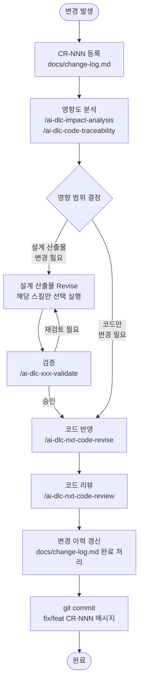

# AI-DLC 변경 관리 가이드

> AI-DLC(AI-Driven Development Lifecycle) 방법론으로 개발 완료된 프로젝트에서  
> **요구사항 변경·추가가 발생했을 때** 산출물 추적성을 유지하며 변경을 관리하는 전 과정 가이드.

---

## 목차

1. [이 가이드에 대하여](#1-이-가이드에-대하여)
2. [변경 관리 핵심 개념](#2-변경-관리-핵심-개념)
3. [변경 요청 접수 & CR 채번](#3-변경-요청-접수--cr-채번)
4. [전체 프로세스 흐름](#4-전체-프로세스-흐름)
5. [단계별 상세 절차](#5-단계별-상세-절차)
6. [변경 유형별 스킬 체인](#6-변경-유형별-스킬-체인)
7. [추적성 관리](#7-추적성-관리)
8. [실전 사례 — CMMC 가중치 오류 수정 (CR-001)](#8-실전-사례--cmmc-가중치-오류-수정-cr-001)
9. [SKILL.md 업데이트 규칙](#9-skillmd-업데이트-규칙)
10. [빠른 참조 카드](#10-빠른-참조-카드)

---

## 1. 이 가이드에 대하여

### 목적

AI-DLC 프로세스(Phase 0~3, 13개 스킬)로 시스템을 완성한 후, 피할 수 없는 **변경**이 발생했을 때를 위한 가이드다.

- **무엇을**: 변경 요청 접수 → 영향도 분석 → 설계 산출물 수정 → 코드 반영 → 완료까지 전 과정
- **어떻게**: AI-DLC 스킬(revise/validate/analysis)을 활용해 자동화
- **왜**: 변경 후에도 FR → UC → SCR → 코드 추적성을 끊기지 않게 유지

### 전제 조건

- AI-DLC로 개발 완료된 프로젝트
- 기존 설계 산출물 존재 (요구사항정의서, 유즈케이스, 화면목록, 데이터설계서, API설계서, 화면정의서)
- Claude Code + AI-DLC 스킬 설치

### 이 가이드 없이 변경하면?

| 문제 | 증상 |
|:---|:---|
| 설계-코드 불일치 | 코드는 수정됐는데 API설계서는 구버전 그대로 |
| 추적성 단절 | "이 코드가 왜 있지?" 원본 FR을 찾을 수 없음 |
| 연쇄 영향 누락 | A를 바꿨더니 B·C가 깨짐 — 사전에 몰랐음 |
| 회귀 버그 | 이미 수정했던 문제가 다시 발생 |

---

## 2. 변경 관리 핵심 개념

### 3가지 원칙

| 원칙 | 설명 | 위반 시 결과 |
|:---|:---|:---|
| **최소 범위 변경** | 변경이 필요한 산출물만 revise, 나머지는 그대로 | 불필요한 재작업, 리스크 증가 |
| **추적성 유지** | CR-NNN → FR-NNN → 산출물 버전 → 코드 연결을 끊지 않음 | 이력 소실, 감사 불가 |
| **검증 후 반영** | validate 통과 없이 코드 반영 금지 | 설계-코드 불일치 누적 |

### 신규 개발 vs 변경 관리 비교

| 항목 | 신규 개발 (AI-DLC Phase 0~3) | 변경 관리 (이 가이드) |
|:---|:---|:---|
| 시작점 | 자연어 요구사항 | CR 등록 + 기존 산출물 |
| 스킬 실행 | 전체 13개 순차 실행 | 영향받는 스킬만 선택 실행 |
| 산출물 버전 | v0.1 (초기 생성) | v0.2, v0.3… (누적 개정) |
| 추적 ID | FR-NNN (신규 채번) | CR-NNN → FR-NNN (연결) |
| 기간 | 수일 (Phase별 단계 진행) | 수시간~1일 (범위에 따라) |

### 스킬 3종 세트: Create → Revise → Validate

AI-DLC 설계 스킬은 **Create(신규) → Revise(변경) → Validate(검증)** 3종 세트로 구성된다.

```
신규 개발:  /ai-dlc-usecase-create   → v0.1
변경 관리:  /ai-dlc-usecase-revise   → v0.2
검증:       /ai-dlc-usecase-validate → VI-NNN 이슈 리포트
```

변경 관리에서는 **Revise + Validate** 쌍만 사용한다.

---

## 3. 변경 요청 접수 & CR 채번

### 변경 유형 분류

| CR 코드 | 유형 | 트리거 예시 | 일반적 영향 범위 |
|:---|:---|:---|:---|
| **CR-NEW** | 신규 요구사항 | "~기능을 추가하고 싶다" | FR → UC → SCR → DATA/API → SPEC → CODE 전체 |
| **CR-REQ** | 요구사항 수정 | "기존 기능의 동작을 바꾸고 싶다" | 영향받는 UC, SCR, API, CODE만 |
| **CR-UI** | 화면/UI 변경 | "이 화면 레이아웃을 바꾸고 싶다" | 화면정의서 → CODE |
| **CR-API** | API 스펙 변경 | "응답 구조를 추가/변경한다" | API설계서 → 화면정의서 → CODE |
| **CR-DB** | DB 스키마 변경 | "컬럼 추가, 타입 변경, 테이블 추가" | 데이터설계서 → CODE → 마이그레이션 |
| **CR-BIZ** | 비즈니스 규칙 변경 | "SPRS 계산 방식이 바뀌었다" | 비즈니스 규칙서 → CODE |
| **CR-BUG** | 버그 수정 | "이 기능이 틀리게 동작한다" | impact-analysis → CODE |
| **CR-INF** | 인프라/설정 변경 | "배포 환경, 환경변수 변경" | 배포가이드 → 설정 파일 |

> **재분류**: CR-BUG로 시작했더라도 impact-analysis 결과 DB나 비즈니스 로직이 관련되면 CR-DB 또는 CR-BIZ로 재분류한다.

### CR 채번 및 등록

변경 발생 즉시 `docs/change-log.md`에 등록한다.

```markdown
# docs/change-log.md CR 목록 테이블

| CR-NNN | 유형 | 제목 | 관련 FR | 영향 산출물 | 상태 | 등록일 | 완료일 |
|:---|:---|:---|:---|:---|:---|:---|:---|
| CR-001 | CR-BUG | Level 2 가중치 오류 수정 | FR-005 | 데이터설계서 v0.2 | ✅ 완료 | 2026-05-24 | 2026-05-24 |
| CR-004 | CR-NEW | 감사 로그 조회 기능 추가 | FR-014 | UC, SCR, API, CODE | 🔄 진행 | 2026-06-01 | - |
```

**상태 코드**: `⏳ 대기` / `🔄 진행` / `✅ 완료` / `❌ 취소`

---

## 4. 전체 프로세스 흐름



### 판단 기준: 설계 산출물 변경이 필요한가?

| 변경 내용 | 설계 산출물 수정 필요? |
|:---|:---|
| 기존 비즈니스 로직의 버그 수정 | ❌ 코드만 수정 |
| 화면 레이아웃/UI 컴포넌트만 변경 | ⚠️ 화면정의서만 |
| API 응답 필드 추가 | ✅ API설계서 + 화면정의서 |
| DB 컬럼 추가/수정 | ✅ 데이터설계서 |
| 새로운 기능 추가 (FR 신규) | ✅ UC → SCR → DATA/API → SPEC 전체 |
| 비즈니스 계산 규칙 변경 | ✅ 비즈니스 규칙서 |

---

## 5. 단계별 상세 절차

### Step 1: 변경 요청 접수

`docs/change-log.md` CR 목록 테이블에 신규 행 추가.

```markdown
| CR-004 | CR-NEW | 감사 로그 조회 기능 추가 | FR-014 | - | ⏳ 대기 | 2026-06-01 | - |
```

CR 상세 섹션에 아래 템플릿 작성:
```markdown
### CR-004 — 감사 로그 조회 기능 추가

**유형**: CR-NEW
**등록일**: 2026-06-01 | **완료일**: -

**변경 원인**
CMMC 심사 준비 중 감사관이 시스템 접근 이력을 요구함.
로그인/로그아웃, 평가 결과 변경 이력을 조회할 수 있는 화면이 필요.

**관련 FR**: FR-014 (신규)
```

---

### Step 2: 영향도 분석

변경 대상 파일 또는 기능에 대한 영향도를 분석한다.

**코드 레벨 영향도** (어떤 파일이 영향받는지):
```
/ai-dlc-impact-analysis src/db/schema.ts checklistItems 테이블 변경 영향 분석
```

출력 예시:
```
직접 영향 (1차):
  - src/db/seed.ts (checklistItems 삽입)
  - src/actions/evaluations.ts (checklistItems 조회)

간접 영향 (2차):
  - src/app/(main)/assessment/level1/page.tsx
  - src/app/(main)/assessment/level2/page.tsx
  - src/app/(main)/gap-analysis/page.tsx

안전 구역 (영향 없음):
  - src/app/(main)/poam/
  - src/app/(main)/report/
```

**문서 레벨 영향도** (어떤 설계 산출물이 영향받는지):

impact-analysis 결과를 바탕으로 수동 판단:

```
변경된 코드 파일 → 관련 설계 ID 역추적

src/db/schema.ts (checklistItems 테이블)
  → 데이터설계서의 checklistItems 엔터티 → 데이터설계서 revise 필요

src/app/(main)/assessment/level2/page.tsx (SCR-004)
  → 화면정의서 SCR-004 → 화면정의서 revise 필요

GET /api/checklist (operationId: getChecklist)
  → API설계서 → API설계서 revise 필요? (스펙 변경인 경우만)
```

---

### Step 3: 설계 산출물 Revise

Step 2에서 수정 필요로 확인된 산출물만 revise한다. **전체를 다시 만들지 않는다.**

```
# 데이터설계서만 변경 필요한 경우
/ai-dlc-data-revise @설계산출물/데이터설계서_CMMC_인증관리시스템_20260523.md
weight 컬럼 값 수정: 3.1.3(5→3), 3.1.4(3→1), 3.1.6(3→1)
NIST SP 800-171 공식 가중치로 정정
```

```
# API설계서 변경 필요한 경우
/ai-dlc-api-revise @설계산출물/API설계서_CMMC_인증관리시스템_20260523.yaml
GET /api/audit-log 엔드포인트 추가:
- 요청: page, limit, action, userId 쿼리 파라미터
- 응답: AuditLog 배열 + pagination
```

**버전 관리 규칙**:
- revise 스킬이 자동으로 버전 증가: `v0.1 → v0.2`
- 파일명에 날짜 반영: `데이터설계서_CMMC_인증관리시스템_20260524.md`
- 문서 내 변경 이력 테이블 자동 추가

---

### Step 4: 검증

revise한 산출물을 validate로 검증한다.

```
/ai-dlc-data-validate @설계산출물/데이터설계서_CMMC_인증관리시스템_20260524.md
```

**검증 결과 해석**:

| 판정 | 의미 | 다음 행동 |
|:---|:---|:---|
| 승인 | 이슈 없음 | Step 5 코드 반영으로 진행 |
| 조건부 승인 | 중요도 낮은 이슈 존재 | VI-NNN 이슈 확인 후 진행 가능 |
| 재검토 필요 | 높은 심각도 이슈 존재 | revise → validate 반복 |

---

### Step 5: 코드 반영

설계 산출물 변경 내용을 코드에 반영한다.

**기존 코드 수정** (변경 범위가 작을 때):
```
/ai-dlc-nxt-code-revise @설계산출물/데이터설계서_CMMC_인증관리시스템_20260524.md
src/db/seed.ts의 Level 2 가중치 데이터를 수정된 설계서 기준으로 업데이트
```

**새 화면 추가** (CR-NEW, CR-UI):
```
/ai-dlc-nxt-page-gen @설계산출물/화면정의서_CMMC_인증관리시스템_20260524.md SCR-012
SCR-012 감사 로그 조회 화면 생성
```

**새 API 추가** (CR-NEW, CR-API):
```
/ai-dlc-nxt-route-handler-gen @설계산출물/API설계서_CMMC_인증관리시스템_20260524.yaml
GET /api/audit-log 엔드포인트 생성
```

**DB 스키마 변경** (CR-DB):
```
# 코드 수정 후 DB에 반영
/ai-dlc-nxt-code-revise src/db/schema.ts auditLogs 테이블 추가
npm run db:push
```

---

### Step 6: 코드 리뷰 & 완료

```
/ai-dlc-nxt-code-review
```

리뷰 완료 후:

1. `docs/change-log.md` CR 목록 상태 → `✅ 완료` 업데이트
2. CR 상세 섹션에 완료 내용 기록
3. git commit (메시지에 CR-NNN 포함):

```bash
git add .
git commit -m "feat(CR-004): 감사 로그 조회 기능 추가 (SCR-012, GET /api/audit-log)"
git push origin [branch]
```

---

## 6. 변경 유형별 스킬 체인

### CR-NEW — 신규 요구사항 추가

**예시**: "감사 로그 조회 화면을 추가하고 싶다"

```
Step 1: CR-NNN 등록 (docs/change-log.md)

Step 2: 영향도 분석
  /ai-dlc-impact-analysis (기존 코드에 미치는 영향)
  /ai-dlc-code-traceability @요구사항정의서 @src/ (기존 FR 커버리지 확인)

Step 3: 설계 산출물 Revise (전체 체인)
  1. 요구사항정의서에 FR-NNN 추가 (수동 편집)
  2. /ai-dlc-usecase-revise → 새 UC 추가
  3. /ai-dlc-usecase-validate → 검증
  4. /ai-dlc-screen-revise → 새 SCR 추가
  5. /ai-dlc-data-revise (DB 변경 필요시)
  6. /ai-dlc-api-revise → 새 엔드포인트 추가
  7. /ai-dlc-api-validate → 검증
  8. /ai-dlc-screen-spec → 새 화면 상세 정의 (신규 SCR이면 create)

Step 4: 코드 구현
  /ai-dlc-nxt-impl-plan (구현 계획 업데이트)
  /ai-dlc-nxt-page-gen (새 화면)
  /ai-dlc-nxt-route-handler-gen (새 API, 해당 시)
  /ai-dlc-nxt-server-action-gen (새 Server Action, 해당 시)

Step 5: /ai-dlc-nxt-code-review
Step 6: git commit + change-log 완료 처리
```

**예상 소요**: 반일~1일 (기능 복잡도에 따라)

---

### CR-REQ — 요구사항 수정

**예시**: "POA&M 완료 기한 필드를 필수에서 선택으로 바꾸고 싶다"

```
Step 1: CR-NNN 등록

Step 2: /ai-dlc-impact-analysis src/actions/poam.ts
  → 영향 파일 확정

Step 3: 설계 산출물 Revise (영향받는 것만)
  /ai-dlc-usecase-revise (UC 흐름 변경 있는 경우)
  /ai-dlc-api-revise (API 스펙 변경 있는 경우)
  /ai-dlc-screen-revise (화면 동작 변경 있는 경우)
  → 해당하는 validate 실행

Step 4: /ai-dlc-nxt-code-revise
Step 5: /ai-dlc-nxt-code-review
Step 6: git commit + change-log 완료 처리
```

**예상 소요**: 수시간

---

### CR-UI — 화면/UI 변경

**예시**: "대시보드 도메인 차트를 파이 차트로 바꾸고 싶다"

```
Step 1: CR-NNN 등록

Step 2: (영향도 분석 생략 가능 — UI 변경은 scope가 명확)

Step 3: /ai-dlc-screen-revise @화면정의서_*.md SCR-002 대시보드 차트 변경
        /ai-dlc-screen-validate → 검증

Step 4: /ai-dlc-nxt-code-revise src/components/dashboard/DomainChart.tsx

Step 5: /ai-dlc-nxt-code-review
Step 6: git commit + change-log 완료 처리
```

**예상 소요**: 1~3시간

---

### CR-API — API 스펙 변경

**예시**: "GET /api/checklist 응답에 도메인별 통계 필드 추가"

```
Step 1: CR-NNN 등록

Step 2: /ai-dlc-impact-analysis src/app/api/checklist/route.ts
  → 호출 측 화면 파일 목록 확인

Step 3:
  /ai-dlc-api-revise @API설계서_*.yaml GET /api/checklist 응답 스키마 변경
  /ai-dlc-api-validate → 검증
  /ai-dlc-screen-revise @화면정의서_*.md (호출 화면의 데이터 표시 변경)

Step 4:
  /ai-dlc-nxt-route-handler-gen (Route Handler 재생성 또는)
  /ai-dlc-nxt-code-revise (호출 측 페이지 수정)

Step 5: /ai-dlc-nxt-code-review
Step 6: git commit + change-log 완료 처리
```

**예상 소요**: 반일

---

### CR-DB — DB 스키마 변경

**예시**: "poam 테이블에 assignee 컬럼 추가"

```
Step 1: CR-NNN 등록

Step 2: /ai-dlc-impact-analysis src/db/schema.ts poamTable
  → 영향: actions/poam.ts, poam/page.tsx, poam/new/page.tsx 등

Step 3:
  /ai-dlc-data-revise @데이터설계서_*.md poam 테이블 assignee 컬럼 추가
  /ai-dlc-data-validate → 검증

Step 4:
  /ai-dlc-nxt-code-revise src/db/schema.ts poamTable에 assignee 컬럼 추가
  npm run db:push
  /ai-dlc-nxt-code-revise src/actions/poam.ts, poam/new/page.tsx (폼 필드 추가)

Step 5: /ai-dlc-nxt-code-review
Step 6: git commit + change-log 완료 처리
```

**예상 소요**: 반일

---

### CR-BIZ — 비즈니스 규칙 변경

**예시**: "가중치 5점 항목 외에 가중치 3점 항목도 POA&M 등록 제한"

```
Step 1: CR-NNN 등록

Step 2: /ai-dlc-impact-analysis src/actions/poam.ts canRegisterPoam 함수
  → 영향: poam/new/page.tsx, poam/[id]/edit/page.tsx

Step 3:
  /ai-dlc-biz-rules-revise POA&M 등록 가능 조건 변경
  /ai-dlc-biz-rules-validate → 검증

Step 4:
  /ai-dlc-nxt-code-revise src/actions/poam.ts canRegisterPoam 로직 수정
  /ai-dlc-nxt-code-revise 관련 테스트 업데이트

Step 5: /ai-dlc-nxt-code-review
Step 6: git commit + change-log 완료 처리
```

**예상 소요**: 수시간

---

### CR-BUG — 버그 수정

**예시**: "updatePoam Server Action에서 Zod 검증 누락"

```
Step 1: CR-NNN 등록

Step 2: /ai-dlc-impact-analysis src/actions/poam.ts updatePoam
  → 직접 영향 파일 확정

Step 3: (설계 산출물 변경 불필요 — 구현 오류)
  단, 비즈니스 로직 오류라면 CR-BIZ로 재분류

Step 4: /ai-dlc-nxt-code-revise src/actions/poam.ts Zod 검증 추가

Step 5: /ai-dlc-nxt-code-review
Step 6: git commit + change-log 완료 처리
```

**예상 소요**: 수시간

---

### CR-INF — 인프라/설정 변경

**예시**: "Vercel 배포 환경변수 추가, NextAuth 설정 수정"

```
Step 1: CR-NNN 등록

Step 2: 영향도 분석 생략 (설정 변경은 scope 명확)

Step 3: (설계 산출물 변경 불필요)
  배포가이드만 업데이트:
  /ai-dlc-nxt-deploy-guide @설계산출물/Vercel배포가이드_*.md 환경변수 추가 내용 반영

Step 4: 코드/설정 파일 수정 (수동 또는 직접 편집)

Step 5: 빌드·배포 검증 (npm run build, vercel --prod)
Step 6: git commit + change-log 완료 처리
```

---

## 7. 추적성 관리

### CR-FR-산출물-코드 추적 매트릭스

`docs/change-log.md`에 CR별 영향 범위를 기록한다.

```markdown
| CR-NNN | FR-NNN | 유즈케이스 | 화면 | 데이터설계서 | API설계서 | 화면정의서 | 코드 파일 |
|:---|:---|:---|:---|:---|:---|:---|:---|
| CR-001 | FR-005 | - | - | v0.2 ✅ | - | - | seed.ts, utils.ts |
| CR-002 | - | - | - | - | - | - | vercel.json (신규) |
| CR-003 | - | - | - | - | - | - | src/lib/auth.ts |
| CR-004 | FR-014 | UC-011 v0.2 | SCR-012 | v0.3 ✅ | v0.2 ✅ | v0.2 ✅ | audit-log/* |
```

### 산출물 버전 관리 규칙

| 규칙 | 내용 |
|:---|:---|
| 초기 버전 | `v0.1` (신규 개발 시 스킬이 자동 부여) |
| 변경 시 증가 | `+0.1` (v0.1 → v0.2 → v0.3…) |
| 파일명 갱신 | `[산출물명]_CMMC_YYYYMMDD.md` (날짜를 변경일로 갱신) |
| 최신 파일 | 날짜가 가장 최신인 파일이 현행 버전 |

**예시**:
```
설계산출물/
├── 데이터설계서_CMMC_인증관리시스템_20260523.md  ← v0.1 (원본, 보존)
├── 데이터설계서_CMMC_인증관리시스템_20260524.md  ← v0.2 (CR-001 반영, 현행)
```

### git 커밋 메시지 규칙

```bash
# 버그 수정
git commit -m "fix(CR-NNN): 변경 내용 요약"

# 신규 기능
git commit -m "feat(CR-NNN): 변경 내용 요약"

# 인프라/설정
git commit -m "chore(CR-NNN): 변경 내용 요약"
```

---

## 8. 실전 사례 — CMMC 가중치 오류 수정 (CR-001)

CMMC 프로젝트에서 실제 발생한 변경을 AI-DLC 변경 관리 프로세스로 재현한다.

### 배경

배포 후 SPRS 시뮬레이터 화면에서 최저점이 -203으로 표시됨.  
NIST SP 800-171 공식 문서 확인 결과 실제 가중치 합계는 218, SPRS 최저점은 -108.

**오류 원인**: seed.ts에 입력된 3개 항목의 weight 값이 잘못됨

| 요구사항 ID | 잘못된 weight | 올바른 weight |
|:---|:---|:---|
| 3.1.3 | 5 | 3 |
| 3.1.4 | 3 | 1 |
| 3.1.6 | 3 | 1 |

### Step 1: CR 등록

```markdown
| CR-001 | CR-BUG | Level 2 점검항목 가중치 오류 수정 | FR-005 | 데이터설계서 v0.2 | 🔄 진행 | 2026-05-24 | - |
```

초기 CR-BUG로 등록 후, 영향도 분석 결과 데이터 설계서와 비즈니스 로직에도 영향 → **CR-DB + CR-BIZ로 재분류**.

### Step 2: 영향도 분석

```
/ai-dlc-impact-analysis src/db/seed.ts Level 2 checklistItems 가중치 변경 영향
```

결과:
```
직접 영향 (1차):
  - src/lib/utils.ts (sprsToPercent 함수 — min값 -203 사용 중)
  - src/app/(main)/sprs/page.tsx (범위 텍스트 "(-203 ~ 110)" 하드코딩)

간접 영향 (2차):
  - src/lib/utils.test.ts (sprsToPercent 테스트 — -203 기준)
  - src/lib/cmmc.test.ts (SPRS 최저점 -203 검증 테스트)

코드 외 영향:
  - 설계산출물/데이터설계서_*.md (weight 컬럼 정의)
```

### Step 3: 설계 산출물 Revise

```
/ai-dlc-data-revise @설계산출물/데이터설계서_CMMC_인증관리시스템_20260523.md
3.1.3 weight 5→3, 3.1.4 weight 3→1, 3.1.6 weight 3→1
참조: docs/cmmc-level2-weight.json (권위 있는 원천 데이터)
```

결과: `데이터설계서_CMMC_인증관리시스템_20260524.md` v0.2 생성

### Step 4: 코드 반영

영향도 분석 결과 파일 순서대로 수정:

```
# 1. seed.ts: DELETE + re-INSERT 전략으로 가중치 정정
src/db/seed.ts
  → await db.delete(checklistItems).where(eq(checklistItems.level, '2'))
  → weight 3.1.3=3, 3.1.4=1, 3.1.6=1 로 재삽입

# 2. utils.ts: min값 수정
src/lib/utils.ts sprsToPercent()
  → const min = -203  →  const min = -108

# 3. sprs/page.tsx: 범위 텍스트 수정
src/app/(main)/sprs/page.tsx
  → "(-203 ~ 110)"  →  "(-108 ~ 110)"

# 4. 테스트 수정
src/lib/utils.test.ts
  → sprsToPercent(-203) → sprsToPercent(-108) → 0%
  → sprsToPercent(0) → 50% (기존 65%)
  → sprsToPercent(88) ≥89% (기존 ≥93%)

src/lib/cmmc.test.ts
  → maxDeduction 313 → 218
  → expect(minScore).toBe(-203) → toBe(-108)
```

### Step 5: 코드 리뷰

```
/ai-dlc-nxt-code-review
```

결과: 테스트 20개 전체 통과 (`npm run test`)

### Step 6: 완료

```bash
git commit -m "fix(CR-001): Level 2 가중치 수정 (SPRS 최저점 -108)"
```

`docs/change-log.md` 상태 → `✅ 완료`

### 교훈

1. **CR 재분류 필수**: CR-BUG로 시작했지만 실제로는 DB(seed)와 비즈니스 로직(sprsToPercent) 모두 관련 → CR-DB + CR-BIZ 복합
2. **impact-analysis의 가치**: 수동으로 찾기 어려운 테스트 파일 2개(utils.test.ts, cmmc.test.ts)를 자동으로 발견
3. **설계서 선행 수정**: 코드보다 설계서를 먼저 수정해야 코드 수정 방향이 명확해짐

---

## 9. SKILL.md 업데이트 규칙

`Harness/SKILL.md`는 Phase별 진행 상태를 관리하는 파일이다.  
변경 발생 시 아래 변경 이력 섹션을 추가·갱신한다.

```markdown
## 변경 이력

| CR-NNN | 일자 | 변경 유형 | 관련 Phase | 실행 스킬 | 결과 |
|:---|:---|:---|:---|:---|:---|
| CR-001 | 2026-05-24 | CR-BUG→CR-DB | 1-3 (데이터설계), 2-3 (코드) | data-revise, code-revise | ✅ 완료 |
| CR-002 | 2026-05-24 | CR-INF | 3-2 (배포) | 수동 | ✅ 완료 |
| CR-003 | 2026-05-24 | CR-INF | 2-1 (프로젝트 설정) | 수동 | ✅ 완료 |
```

**업데이트 시점**: CR 완료 시 즉시 추가.

---

## 10. 빠른 참조 카드

### 변경 유형별 스킬 체인 요약

| 유형 | 영향도 분석 | 설계 산출물 | 코드 구현 | 검토 |
|:---|:---|:---|:---|:---|
| **CR-NEW** | impact + traceability | usecase-revise → validate<br>screen-revise → validate<br>data-revise → validate (선택)<br>api-revise → validate<br>screen-spec | impl-plan<br>page-gen<br>route-handler-gen (선택)<br>server-action-gen (선택) | code-review |
| **CR-REQ** | impact | 영향 산출물 revise → validate | code-revise | code-review |
| **CR-UI** | (생략 가능) | screen-revise → validate | page-gen 또는 code-revise | code-review |
| **CR-API** | impact | api-revise → validate<br>screen-revise → validate | route-handler-gen<br>code-revise (호출 측) | code-review |
| **CR-DB** | impact | data-revise → validate | code-revise (schema.ts, seed.ts)<br>+ npm run db:push | code-review |
| **CR-BIZ** | impact | biz-rules-revise → validate | code-revise | code-review |
| **CR-BUG** | impact | (불필요, 단 CR-BIZ 재분류 확인) | code-revise | code-review |
| **CR-INF** | (생략 가능) | deploy-guide 업데이트 | 설정 파일 수정 | 배포 검증 |

### 체크리스트

변경 완료 전 아래 항목을 확인한다:

- [ ] `docs/change-log.md`에 CR-NNN 등록 및 완료 처리
- [ ] 영향받은 설계 산출물 버전 증가 (파일명 날짜 갱신)
- [ ] validate 통과 확인 (승인 또는 조건부 승인)
- [ ] 코드 변경 파일이 impact-analysis 결과와 일치
- [ ] 테스트 통과 (`npm run test`)
- [ ] 빌드 성공 (`npm run build`)
- [ ] git commit 메시지에 CR-NNN 포함
- [ ] `Harness/SKILL.md` 변경 이력 섹션 업데이트

### 분석 스킬 명령어 템플릿

```bash
# 코드 레벨 영향도
/ai-dlc-impact-analysis [파일경로 또는 함수명] [변경 설명]

# FR → 코드 추적성 확인
/ai-dlc-code-traceability @요구사항정의서_CMMC_*.md @src/

# 의존성 분석
/ai-dlc-dependency-analysis src/
```

### 설계 산출물 Revise 명령어 템플릿

```bash
# 유즈케이스
/ai-dlc-usecase-revise @설계산출물/유즈케이스_CMMC_*.md [변경 내용 설명]

# 화면 목록 + 화면 정의서
/ai-dlc-screen-revise @설계산출물/화면목록_CMMC_*.md [변경 내용 설명]

# 데이터 설계서
/ai-dlc-data-revise @설계산출물/데이터설계서_CMMC_*.md [변경 내용 설명]

# API 설계서
/ai-dlc-api-revise @설계산출물/API설계서_CMMC_*.yaml [변경 내용 설명]

# 비즈니스 규칙
/ai-dlc-biz-rules-revise [변경 내용 설명]
```

### 코드 구현 명령어 템플릿

```bash
# 기존 코드 수정
/ai-dlc-nxt-code-revise @설계산출물/[변경된_산출물] [수정 대상 파일 경로] [변경 내용]

# 새 화면 생성
/ai-dlc-nxt-page-gen @설계산출물/화면정의서_CMMC_*.md SCR-NNN

# 새 Route Handler 생성
/ai-dlc-nxt-route-handler-gen @설계산출물/API설계서_CMMC_*.yaml [operationId]

# 새 Server Action 생성
/ai-dlc-nxt-server-action-gen @설계산출물/API설계서_CMMC_*.yaml [도메인명]

# 코드 리뷰
/ai-dlc-nxt-code-review
```

---

*관련 파일*:
- `AI-DLC-README.md` — AI-DLC 신규 개발 전 과정 학습 가이드
- `docs/change-log.md` — CR-NNN 기반 변경 이력 추적 테이블
- `Harness/SKILL.md` — Phase별 진행 상태 및 변경 이력
- `설계산출물/` — 현행 설계 산출물 (날짜가 가장 최신인 파일이 현행 버전)
