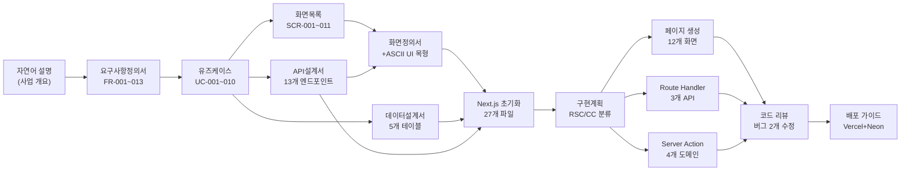
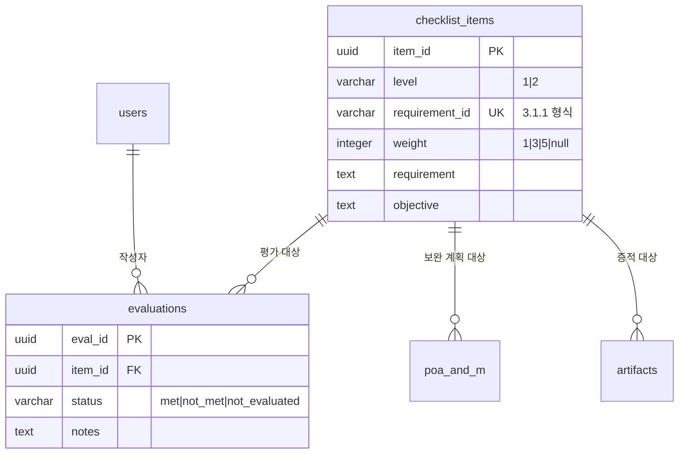

# AI-DLC 실전 가이드: CMMC 인증관리 시스템 개발 전 과정

> **이 문서의 목적**
> AI-DLC 방법론을 처음 접하는 입문자가 CMMC 인증관리 시스템 개발 사례를 통해
> 요구사항 정의부터 코드 배포까지 전 과정을 직접 따라할 수 있도록 안내합니다.

---

## 목차

1. [이 가이드에 대하여](#1-이-가이드에-대하여)
2. [AI-DLC란?](#2-ai-dlc란)
3. [시작 전 준비](#3-시작-전-준비)
4. [13개 스킬 한눈에 보기](#4-13개-스킬-한눈에-보기)
5. [Phase 0 — 요구사항 정의](#5-phase-0--요구사항-정의)
6. [Phase 1 — 설계 단계](#6-phase-1--설계-단계)
7. [Phase 2 — 개발 단계](#7-phase-2--개발-단계)
8. [Phase 3 — 검증 및 배포](#8-phase-3--검증-및-배포)
9. [보완 작업 — 테스트 생성](#9-보완-작업--테스트-생성)
10. [산출물 추적성 맵](#10-산출물-추적성-맵)
11. [실전 트러블슈팅](#11-실전-트러블슈팅)
12. [3일 타임라인 & 생산성 지표](#12-3일-타임라인--생산성-지표)
13. [빠른 참조 카드](#13-빠른-참조-카드)

---

## 1. 이 가이드에 대하여

### 무엇을 만들었나?

**CMMC 인증관리 시스템** — CMMC(Cybersecurity Maturity Model Certification) Level 1/2
인증 준비를 위한 AS-IS 점검·갭 분석·POA&M 추적 관리 웹 애플리케이션

**3일 만에 달성한 것**:

| 항목 | 수치 |
|:---|---:|
| DB 점검항목 마스터 | 125개 (Level 1: 15개 + Level 2: 110개) |
| 화면(SCR) | 12개 |
| 소스 코드 파일 | 50+개 |
| 단위 테스트 | 20개 |
| 설계 문서 | 7개 파일 (~170KB) |

### 대상 독자

- Claude Code를 설치해본 적 있는 사람
- AI-DLC 스킬(`/ai-dlc-xxx`)을 처음 사용하는 사람
- "AI로 웹앱을 처음부터 끝까지 만들어보고 싶다"는 사람

### 전제 조건

- Claude Code 설치 완료
- AI-DLC 스킬 설치 완료 (`/skills` 명령어로 목록 확인 가능)
- 프로젝트 디렉터리 생성 완료

---

## 2. AI-DLC란?

**AI-DLC(AI-Driven Development Lifecycle)**는 소프트웨어 개발 전 주기를
표준화된 프롬프트 템플릿(스킬)으로 자동화하는 방법론입니다.

### 핵심 개념 3가지

| 개념 | 설명 | CMMC 프로젝트 예시 |
|:---|:---|:---|
| **스킬(Skill)** | Claude Code에서 `/ai-dlc-xxx`로 호출하는 표준화 프롬프트 | `/ai-dlc-requirements` |
| **산출물 체계** | ID로 추적 가능한 문서 연쇄 (FR→UC→SCR→API→코드) | FR-007 → UC-006 → SCR-006 → `poam.ts` |
| **SKILL.md** | Phase별 진행 상태를 한 파일로 관리하는 진행판 | ✅완료 / 🔄진행중 / ⏳대기 |

### 전통 개발 vs AI-DLC 비교

| 작업 | 전통 개발 | AI-DLC | 단축 시간 |
|:---|:---|:---|:---:|
| 요구사항 정의서 작성 | 8시간 | ~1시간 | **87%↓** |
| 유즈케이스 시나리오 작성 | 4시간 | ~30분 | **87%↓** |
| ERD + 테이블 정의서 | 4시간 | ~30분 | **87%↓** |
| API 설계서 (OpenAPI) | 6시간 | ~30분 | **91%↓** |
| 화면 정의서 (11개 화면) | 16시간 | ~1시간 | **93%↓** |
| 코드 생성 (50+파일) | 40시간 | ~4시간 | **90%↓** |

> **핵심**: AI-DLC는 개발자를 대체하지 않습니다. 반복적인 문서 작성과 코드 뼈대 생성을
> 자동화하여 인간이 **판단과 검증에 집중**할 수 있게 합니다.

### SKILL.md: 프로젝트 진행판

모든 AI-DLC 프로젝트는 `Harness/SKILL.md` 파일을 진행판으로 사용합니다:

```markdown
| Phase | 스킬 명령어 | 산출물 | 상태 |
|:---|:---|:---|:---:|
| Phase 0 | /ai-dlc-requirements | 요구사항정의서.md | ✅ 완료 |
| Phase 1-1 | /ai-dlc-usecase-create | 유즈케이스.md | ✅ 완료 |
| Phase 1-2 | /ai-dlc-screen-list | 화면목록.md | 🔄 진행중 |
| Phase 1-3 | /ai-dlc-data-design | 데이터설계서.md | ⏳ 대기 |
```

SKILL.md가 있으면 언제든지 "어디까지 했는지"를 파악하고 이어서 진행할 수 있습니다.

---

## 3. 시작 전 준비

### Claude Code 설치 확인

```bash
claude --version
# Claude Code v2.1.149 이상 권장
```

### 스킬 설치 확인

Claude Code 내에서:

```
/skills
```

`ai-dlc-requirements`, `ai-dlc-usecase-create` 등이 목록에 보여야 합니다.

### 프로젝트 폴더 구조

AI-DLC 프로젝트는 아래 구조로 시작합니다:

```
my-project/
├── Harness/
│   ├── SKILL.md       ← 진행판 (Phase별 상태 추적)
│   ├── AGENT.md       ← 에이전트 행동 지침
│   ├── ARCHITECT.md   ← 시스템 아키텍처 요약
│   └── PRD.md         ← 제품 요구사항 요약
├── docs/
│   └── [도메인 참조 자료]
└── 설계산출물/         ← 스킬 실행 후 자동 생성
```

### 보안 주의사항

```bash
# .env.local은 절대 커밋하지 않습니다
echo ".env.local" >> .gitignore

# 환경변수 예시 파일만 커밋
cp .env.local .env.example
# .env.example에서 실제 값은 삭제
```

---

## 4. 13개 스킬 한눈에 보기

CMMC 프로젝트에서 실제 사용한 스킬 목록입니다.

| Phase | 스킬 | 역할 | 주요 입력 | 산출물 | CMMC 결과 |
|:---|:---|:---|:---|:---|:---|
| **0** | `/ai-dlc-requirements` | 요구사항 정의 | 자연어 사업설명 | 요구사항정의서.md | FR 13개 확정 |
| **1-1** | `/ai-dlc-usecase-create` | 유즈케이스 | 요구사항정의서 | 유즈케이스.md | UC 10개 생성 |
| **1-2** | `/ai-dlc-screen-list` | 화면 목록 | 유즈케이스 | 화면목록.md | SCR 11개 도출 |
| **1-3** | `/ai-dlc-data-design` | 데이터 모델 | 유즈케이스 | 데이터설계서.md | 5개 테이블 ERD |
| **1-4** | `/ai-dlc-api-design` | API 설계 | UC+화면목록 | API설계서.yaml | 13개 엔드포인트 |
| **1-5** | `/ai-dlc-screen-spec` | 화면 정의서 | 화면목록+API | 화면정의서.md | 11개 화면 상세 |
| **2-1** | `/ai-dlc-nxt-project-setup` | 프로젝트 초기화 | 기술스택 결정 | 설정파일 27개 | Next.js 구조 |
| **2-2** | `/ai-dlc-nxt-impl-plan` | 구현 계획 | 화면정의서+API | 구현계획.md | RSC/CC 분류 |
| **2-3** | `/ai-dlc-nxt-page-gen` | 페이지 생성 | 구현계획+SCR | page.tsx 등 | 12개 화면 완성 |
| **2-4** | `/ai-dlc-nxt-route-handler-gen` | Route Handler | API설계서 | route.ts | 3개 API 엔드포인트 |
| **2-5** | `/ai-dlc-nxt-server-action-gen` | Server Action | API설계서 | actions/*.ts | 4개 도메인 액션 |
| **3-1** | `/ai-dlc-nxt-code-review` | 코드 리뷰 | src/ 전체 | 리뷰 보고서 | 버그 2개 발견·수정 |
| **3-2** | `/ai-dlc-nxt-deploy-guide` | 배포 가이드 | 프로젝트 정보 | 배포가이드.md | Vercel 배포 절차 |

### 산출물 흐름 다이어그램



> 자연어 설명이 최종 코드까지 **ID로 추적 가능**하게 연결됩니다.

---

## 5. Phase 0 — 요구사항 정의

**스킬**: `/ai-dlc-requirements`  
**소요 시간**: ~1시간 (인터뷰 포함)  
**산출물**: `요구사항정의서_{사업명}_{YYYYMMDD}.md`

### 실제 입력 명령어

```
/ai-dlc-requirements CMMC level1, level2 를 달성하기 위해 각 점검항목에 대해
AS-IS 현황을 먼저 확인하여 부족한 부분이 어떤 것인지 확인하고 기록하고
이를 보완할 계획을 수립하여 이를 추적관리 함으로 본 심사를 준비하고
관리할 수 있는 웹 어플리케이션을 구축하고 싶다.
@docs\cmmc-level1.md @docs\cmmc-level2.md 파일의 점검 항목을 참고하여
계획을 수립한다. 요구사항 분석서를 작성하기 위해 추가로 의사결정이 필요한
부분이 있으면 질문을 통해 보완하여 문서를 확정한다.
```

> **팁**: `@파일명`으로 도메인 참조 자료를 함께 넘기면 스킬이 도메인 지식을 자동 반영합니다.

### 스킬 동작 3단계

```
1. 입력 파싱
   └─ 자연어에서 FR 후보 자동 추출 + @참조 파일 내용 통합

2. 인터뷰 (최대 3개 질문)
   └─ 기술스택, 개발 기간, 인프라 환경 확인

3. 파일 자동 저장
   └─ 요구사항정의서_CMMC_인증관리시스템_20260523.md (224줄)
```

실제 인터뷰 답변 예시:

| 질문 | 답변 |
|:---|:---|
| Frontend 기술스택? | React (권장) |
| Backend/DB? | Next.js 기반 node.js 통합, DB는 파일DB 형태 |
| 인프라 환경? | Vercel에 배포하여 개발 시안만 확인 |

### 산출물 핵심 발췌 — FR 목록

| ID | 요구사항명 | 중요도 |
|:---|:---|:---:|
| FR-001 | CMMC Level 선택 및 전환 | 상 |
| FR-002 | Level 1 점검항목 조회 (15개) | 상 |
| FR-003 | Level 2 점검항목 조회 (110개) | 상 |
| FR-004 | AS-IS 평가 결과 입력 (MET/NOT MET) | 상 |
| FR-005 | 평가 노트 입력 | 중 |
| FR-006 | 갭 분석(Gap Analysis) 조회 | 상 |
| FR-007 | POA&M 등록 및 관리 | 상 |
| FR-008 | 증적(Artifact) 참조 등록 | 중 |
| FR-009 | 진행 현황 대시보드 | 상 |
| FR-010 | SPRS 점수 시뮬레이터 | 상 |
| FR-011 | 평가 리포트 출력 | 중 |
| FR-012 | 점검 진행률 표시 | 중 |
| FR-013 | 데이터 초기화 / 재평가 | 하 |

총 32개 요구사항 (FR 13 + PR 2 + SR 3 + QR 3 + IR 2 + DR 5 + CR 4)

---

## 6. Phase 1 — 설계 단계

Phase 1은 5개 스킬을 **순서대로** 실행합니다. 각 스킬의 산출물이 다음 스킬의 입력이 됩니다.

### 6-1. 유즈케이스 생성

**스킬**: `/ai-dlc-usecase-create`  
**소요 시간**: ~30분  
**산출물**: `설계산출물/유즈케이스_CMMC_인증관리시스템_20260523.md` (480줄)

```
/ai-dlc-usecase-create @요구사항정의서_CMMC_인증관리시스템_20260523.md
파일을 기반으로 유즈케이스를 작성하라.
```

**스킬이 자동으로 한 일**:
- FR 13개를 분석하여 10개 UC로 그룹핑
- 각 UC마다 기본 흐름·대안 흐름·예외 흐름 작성
- FR-UC 커버리지 100% 달성 확인
- Mermaid 유즈케이스 다이어그램 자동 생성

**산출물 발췌** (UC 목록):

| UC-ID | 유즈케이스명 | 연계 FR |
|:---|:---|:---|
| UC-001 | 시스템 로그인 | SR-001, SR-003 |
| UC-002 | 대시보드 현황 조회 | FR-009, FR-012 |
| UC-003 | Level 1 점검항목 평가 | FR-001, FR-002, FR-004, FR-005 |
| UC-004 | Level 2 점검항목 평가 | FR-001, FR-003, FR-004, FR-005 |
| UC-005 | 갭 분석 조회 | FR-006 |
| UC-006 | POA&M 보완 계획 관리 | FR-007 |
| UC-007 | 증적 참조 등록 | FR-008 |
| UC-008 | SPRS 점수 시뮬레이션 | FR-010 |
| UC-009 | 평가 리포트 출력 | FR-011 |
| UC-010 | 평가 데이터 초기화 | FR-013 |

---

### 6-2. 화면 목록 도출

**스킬**: `/ai-dlc-screen-list`  
**소요 시간**: ~20분  
**산출물**: `설계산출물/화면목록_CMMC_인증관리시스템_20260523.md` (128줄)

```
/ai-dlc-screen-list 진행하라.
```

> **팁**: 앞 단계 산출물이 Harness 컨텍스트에 이미 로드되어 있으므로 짧은 명령어로도 됩니다.

**스킬이 자동으로 한 일**:
- UC 단계에서 화면 단위 추출 (조회/등록/수정/삭제 분류)
- SCR-NNN 채번 (001부터 순서대로)
- GNB 메뉴 계층 구조 설계
- 역할별 접근권한 자동 매핑

**산출물 발췌** (화면 목록):

| SCR-ID | 화면명 | 유형 | 연계 UC |
|:---|:---|:---:|:---|
| SCR-001 | 로그인 | AUTH | UC-001 |
| SCR-002 | 대시보드 | DASH | UC-002 |
| SCR-003 | Level 1 점검 평가 | LIST | UC-003 |
| SCR-004 | Level 2 점검 평가 | LIST | UC-004 |
| SCR-005 | 갭 분석 | LIST | UC-005 |
| SCR-006 | POA&M 목록 | LIST | UC-006 |
| SCR-007 | POA&M 등록·수정 | FORM | UC-006 |
| SCR-008 | 증적 관리 | LIST | UC-007 |
| SCR-009 | SPRS 시뮬레이터 | DASH | UC-008 |
| SCR-010 | 평가 리포트 | LIST | UC-009 |
| SCR-011 | 시스템 설정 (관리자) | FORM | UC-010 |

---

### 6-3. 데이터 모델 설계

**스킬**: `/ai-dlc-data-design`  
**소요 시간**: ~30분  
**산출물**: `설계산출물/데이터설계서_CMMC_인증관리시스템_20260523.md` (22KB)

```
/ai-dlc-data-design @설계산출물/유즈케이스_CMMC_인증관리시스템_20260523.md
파일을 기반으로 데이터 모델을 설계하라.
DB는 Neon Postgres(PostgreSQL)이며 Drizzle ORM을 사용한다.
```

> **팁**: DB 종류를 명시하면 타입 매핑이 자동 최적화됩니다. (VARCHAR vs TEXT, TIMESTAMP tz 등)

**스킬이 자동으로 한 일**:
- UC에서 엔터티 후보 자동 추출
- 3NF 정규화 적용
- 논리 ERD → 물리 ERD → DDL 초안 순서로 생성
- Mermaid erDiagram 다이어그램 포함

**산출물 발췌** (5개 테이블):



---

### 6-4. API 설계

**스킬**: `/ai-dlc-api-design`  
**소요 시간**: ~30분  
**산출물**: `설계산출물/API설계서_CMMC_인증관리시스템_20260523.yaml` (51KB, OpenAPI 3.0)

```
/ai-dlc-api-design @설계산출물/유즈케이스_CMMC_인증관리시스템_20260523.md
@설계산출물/화면목록_CMMC_인증관리시스템_20260523.md 파일을 기반으로
Next.js Route Handler 기반 REST API를 설계하라.
```

**산출물 발췌** (13개 엔드포인트):

| 메서드 | 경로 | 설명 | 연계 SCR |
|:---|:---|:---|:---|
| GET | `/api/checklist` | 점검항목 조회 | SCR-003, SCR-004 |
| GET | `/api/evaluations` | 평가 결과 조회 | SCR-003, SCR-004 |
| POST | `/api/evaluations` | 평가 결과 저장 | SCR-003, SCR-004 |
| GET | `/api/gap-analysis` | 갭 분석 조회 | SCR-005 |
| GET | `/api/sprs` | SPRS 점수 계산 | SCR-009 |
| GET | `/api/poam` | POA&M 목록 조회 | SCR-006 |
| POST | `/api/poam` | POA&M 등록 | SCR-007 |
| PUT | `/api/poam/[id]` | POA&M 수정 | SCR-007 |
| DELETE | `/api/poam/[id]` | POA&M 삭제 | SCR-006 |
| GET | `/api/artifacts` | 증적 목록 조회 | SCR-008 |
| POST | `/api/artifacts` | 증적 등록 | SCR-008 |
| DELETE | `/api/artifacts` | 증적 삭제 | SCR-008 |
| GET | `/api/report/export` | 리포트 내보내기 | SCR-010 |

---

### 6-5. 화면 정의서

**스킬**: `/ai-dlc-screen-spec`  
**소요 시간**: ~1시간  
**산출물**: `설계산출물/화면정의서_CMMC_인증관리시스템_20260523.md` (52KB)

```
/ai-dlc-screen-spec @설계산출물/화면목록_CMMC_인증관리시스템_20260523.md
@설계산출물/API설계서_CMMC_인증관리시스템_20260523.yaml
파일을 기반으로 화면 정의서를 작성하라.
```

**스킬이 자동으로 한 일**:
- SCR-001~011 전체 화면의 레이아웃·입출력·이벤트·API 연계 명세 작성
- **ASCII UI 목형** 포함으로 개발자가 즉시 이해 가능

**산출물 발췌** (SCR-003 일부):

```
┌─────────────────────────────────────────────────────┐
│ CMMC Level 1 점검 평가                    [내보내기] │
├─────────────────────────────────────────────────────┤
│ 진행률: ████████░░ 73% (11/15)                       │
├─────────────────────────────────────────────────────┤
│ [AC] 접근 통제 ▼                                    │
│  AC.L1-b.1.i  시스템 접근을 인가된 사용자로 제한    │
│               ○ MET  ● NOT MET  ○ 미평가            │
│               [메모 입력...        ] [저장]         │
└─────────────────────────────────────────────────────┘
```

> **설계 단계 완료 시 확보하는 것**:
> - 무엇을 만들지 (FR 13개)
> - 누가 어떻게 쓰는지 (UC 10개)
> - 어떤 화면이 있는지 (SCR 11개)
> - 데이터 구조 (5개 테이블)
> - API 명세 (13개 엔드포인트)
> - 화면별 상세 정의 (ASCII 포함)

---

## 7. Phase 2 — 개발 단계

### 7-1. Next.js 프로젝트 초기화

**스킬**: `/ai-dlc-nxt-project-setup`  
**소요 시간**: ~30분 (파일 생성 + 의존성 설치)  
**산출물**: 설정 파일 27개, `src/` 초기 구조

```
/ai-dlc-nxt-project-setup 진행하라.
```

**자동 생성된 파일 (주요)**:

```
my-project/
├── package.json           ← 모든 의존성 (Next.js 15, Drizzle, shadcn 등)
├── next.config.ts
├── tsconfig.json          ← strict mode 적용
├── tailwind.config.ts
├── drizzle.config.ts
├── .env.example           ← DATABASE_URL, NEXTAUTH_SECRET 등 환경변수 예시
└── src/
    ├── app/
    │   ├── layout.tsx     ← Root Layout
    │   ├── (auth)/login/  ← 로그인 화면
    │   └── (main)/        ← 인증 필요 화면들
    ├── db/
    │   ├── schema.ts      ← Drizzle 스키마
    │   └── seed.ts        ← 마스터 데이터 시드
    ├── lib/
    │   ├── auth.ts        ← NextAuth.js 설정
    │   └── utils.ts
    ├── middleware.ts       ← 인증 + 역할 기반 접근 제어
    └── types/
```

> ⚠️ **주의**: Tailwind v4 + shadcn/ui nova 호환성 문제가 발생할 수 있습니다.
> 트러블슈팅 섹션 **#1번** 참조.

**기술 스택 결정 포인트** — 이 프로젝트에서 선택한 이유:

| 기술 | 선택 이유 |
|:---|:---|
| Neon Postgres | Vercel 대시보드에서 1클릭 연동, `DATABASE_URL` 자동 주입 |
| Drizzle ORM | TypeScript-first, 마이그레이션 관리 용이 |
| NextAuth.js v5 | Next.js 15와 공식 통합, Credentials 방식 |
| Tailwind CSS v4 | shadcn/ui nova 프리셋 기본 지원 |

---

### 7-2. 구현 계획 수립

**스킬**: `/ai-dlc-nxt-impl-plan`  
**소요 시간**: ~20분  
**산출물**: `설계산출물/Next.js구현계획_20260523.md` (15KB)

```
/ai-dlc-nxt-impl-plan 진행하라.
```

**스킬이 자동으로 한 일**:
- SCR-NNN → `app/` 라우트 경로 매핑
- RSC(서버 컴포넌트) vs CC(클라이언트 컴포넌트) 자동 분류

**RSC/CC 판단 기준**:

| 조건 | 분류 |
|:---|:---:|
| DB 직접 조회 | RSC |
| SEO 필요 | RSC |
| onClick, onChange 이벤트 | CC |
| useState, useEffect 사용 | CC |
| Toast, Dialog, 폼 제출 | CC |

**CMMC 프로젝트 분류 결과**:
- 12개 page.tsx 중 **10개 RSC**, 2개 CC
- 24개 컴포넌트 중 **16개 RSC**, 8개 CC

---

### 7-3~5. 코드 생성

세 가지 스킬을 **순서대로** 실행합니다:

#### 페이지 생성 (2-3)

```
/ai-dlc-nxt-page-gen 진행하라. 적절한 agent를 활용하라.
```

> **팁**: `적절한 agent를 활용하라` 지시어를 추가하면 Claude가 여러 화면을 병렬로 생성합니다.

**생성 결과**:

| 라우트 | 화면 | 타입 |
|:---|:---|:---:|
| `/(auth)/login` | SCR-001 로그인 | CC |
| `/(main)/dashboard` | SCR-002 대시보드 | RSC |
| `/(main)/assessment/level1` | SCR-003 Level 1 점검 | RSC+CC |
| `/(main)/assessment/level2` | SCR-004 Level 2 점검 | RSC+CC |
| `/(main)/gap-analysis` | SCR-005 갭 분석 | RSC |
| `/(main)/poam` | SCR-006 POA&M 목록 | RSC |
| `/(main)/poam/new` | SCR-007 POA&M 등록 | CC |
| `/(main)/poam/[id]/edit` | SCR-007 POA&M 수정 | CC |
| `/(main)/artifacts` | SCR-008 증적 관리 | RSC+CC |
| `/(main)/sprs` | SCR-009 SPRS 시뮬레이터 | RSC |
| `/(main)/report` | SCR-010 리포트 | RSC |
| `/(main)/settings` | SCR-011 설정 (관리자) | CC |

#### Route Handler 생성 (2-4)

```
/ai-dlc-nxt-route-handler-gen evaluations 도메인
```

**생성된 파일**:
- `src/app/api/poam/[id]/route.ts` — POA&M 단건 수정·삭제
- `src/app/api/report/export/route.ts` — 리포트 CSV 내보내기
- `src/app/api/auth/[...nextauth]/route.ts` — NextAuth.js 핸들러

#### Server Action 생성 (2-5)

```
/ai-dlc-nxt-server-action-gen evaluations 평가결과 저장·수정
/ai-dlc-nxt-server-action-gen poam POA&M CRUD
/ai-dlc-nxt-server-action-gen artifacts 증적 등록·삭제
/ai-dlc-nxt-server-action-gen settings 데이터 초기화
```

**생성된 파일**:
- `src/actions/evaluation.ts` — 평가 결과 UPSERT
- `src/actions/poam.ts` — POA&M CRUD
- `src/actions/artifact.ts` — 증적 등록·삭제
- `src/actions/settings.ts` — 데이터 초기화

> **Server Actions vs Route Handlers 선택 기준**:
> - **Server Actions**: 폼 제출, 내부 뮤테이션 (브라우저 전용)
> - **Route Handlers**: 외부 노출 필요 API, 파일 다운로드, 웹훅

---

## 8. Phase 3 — 검증 및 배포

### 8-1. 코드 리뷰

**스킬**: `/ai-dlc-nxt-code-review`  
**소요 시간**: ~20분  
**산출물**: 코드 품질 보고서 (버그 리스트 포함)

```
/ai-dlc-nxt-code-review
```

**CMMC 프로젝트에서 발견된 실제 버그 2개**:

**버그 #1 — `updatePoam` Zod 검증 누락**

```typescript
// 수정 전: 검증 없이 바로 DB 업데이트
export async function updatePoam(id: string, data: unknown) {
  await db.update(poam).set(data).where(eq(poam.id, id)) // ← 위험
}

// 수정 후: Zod로 입력 검증 추가
const updatePoamSchema = poamSchema.omit({ itemId: true })
export async function updatePoam(id: string, data: unknown) {
  const parsed = updatePoamSchema.safeParse(data)
  if (!parsed.success) return { success: false, error: parsed.error.errors[0].message }
  await db.update(poam).set(parsed.data).where(eq(poam.id, id))
}
```

**버그 #2 — Level 2 `objective` 필드 SELECT 누락**

```typescript
// 수정 전: objective 필드가 SELECT에서 빠짐
const items = await db.select({
  itemId: checklistItems.itemId,
  requirement: checklistItems.requirement,
  // objective 없음!
}).from(checklistItems)

// 수정 후: objective 추가
const items = await db.select({
  itemId: checklistItems.itemId,
  requirement: checklistItems.requirement,
  objective: checklistItems.objective,  // ← 추가
}).from(checklistItems)
```

---

### 8-2. 배포 가이드

**스킬**: `/ai-dlc-nxt-deploy-guide`  
**소요 시간**: ~15분  
**산출물**: `설계산출물/Vercel배포가이드_CMMC_인증관리시스템_20260524.md`

```
/ai-dlc-nxt-deploy-guide
```

**Vercel + Neon Postgres 배포 절차**:

```bash
# 1. Vercel 프로젝트 생성
vercel --prod

# 2. Neon Postgres 연동 (Vercel 대시보드)
# Storage → Neon Postgres → Create → DATABASE_URL 자동 주입

# 3. 필수 환경변수 설정 (Vercel 대시보드 → Settings → Environment Variables)
DATABASE_URL=postgresql://...   # Neon에서 자동 주입
NEXTAUTH_SECRET=                # openssl rand -base64 32
NEXTAUTH_URL=https://your-app.vercel.app
ADMIN_EMAIL=admin@example.com
ADMIN_PASSWORD=...

# 4. DB 스키마 적용
npm run db:push

# 5. 마스터 데이터 시드 (125개 점검항목)
npm run db:seed

# 6. 배포 확인
vercel --prod
```

---

## 9. 보완 작업 — 테스트 생성

### 스킬 체계의 공백 발견

CMMC 프로젝트를 진행하면서 표준 AI-DLC 스킬 체계에 **단위 테스트 생성 스킬**이
없다는 것을 발견했습니다. 이는 학습 포인트입니다:

> **AI-DLC 스킬은 완전하지 않습니다.**
> 프로젝트를 진행하면서 누락된 영역을 발견하고 직접 보완해야 합니다.

### 수동 보완: Vitest 단위 테스트

비즈니스 로직 핵심 함수에 대한 20개 테스트를 직접 작성했습니다:

```bash
# 설치
npm install -D vitest @vitest/coverage-v8

# package.json에 추가
"test": "vitest run",
"test:watch": "vitest",
```

**테스트 대상 함수들**:

```typescript
// src/lib/utils.ts
sprsToPercent(score)  // SPRS 점수 → 진행률 변환

// src/lib/cmmc.test.ts (인라인 순수 함수)
calcSprs(items)       // NOT MET 항목 감점 계산
canRegisterPoam(item) // POA&M 등록 가능 여부
```

**실행 결과**:

```
Test Files  2 passed (2)
     Tests  20 passed (20)
  Duration  682ms
```

---

## 10. 산출물 추적성 맵

AI-DLC의 핵심 가치는 **요구사항부터 코드까지 ID로 추적 가능**하다는 것입니다.
아래 3가지 실제 경로로 확인할 수 있습니다.

### 경로 1: SPRS 시뮬레이터

```
FR-010 (SPRS 점수 시뮬레이터)
  → UC-008 (SPRS 점수 시뮬레이션)
    → SCR-009 (SPRS 시뮬레이터 화면)
      → GET /api/sprs (operationId: getSprsScore)
        → src/app/(main)/sprs/page.tsx
          → src/lib/utils.ts : sprsToPercent()
            → src/lib/utils.test.ts (5개 테스트)
```

### 경로 2: Level 2 점검 평가

```
FR-003 (Level 2 점검항목 조회)
FR-004 (AS-IS 평가 결과 입력)
  → UC-004 (Level 2 점검항목 평가)
    → SCR-004 (Level 2 점검 평가 화면)
      → GET /api/checklist?level=2
        → src/app/(main)/assessment/level2/page.tsx
          → src/db/schema.ts : checklistItems
            → src/db/seed.ts (Level 2 110개 마스터 데이터)
              → docs/cmmc-level2-weight.json (가중치 원천 데이터)
```

### 경로 3: POA&M 관리

```
FR-007 (POA&M 등록 및 관리)
  → UC-006 (POA&M 보완 계획 관리)
    → SCR-006 (POA&M 목록)
    → SCR-007 (POA&M 등록·수정 폼)
      → POST /api/poam, PUT /api/poam/[id]
        → src/actions/poam.ts : createPoam(), updatePoam()
          → src/db/schema.ts : poamTable
            → src/app/(main)/poam/new/page.tsx
            → src/app/(main)/poam/[id]/edit/page.tsx
```

---

## 11. 실전 트러블슈팅

CMMC 프로젝트에서 실제로 발생한 문제와 해결법입니다.

---

### 문제 #1 — Tailwind v4 + shadcn/ui nova 호환성

**증상**: CSS 클래스가 적용되지 않거나 스타일이 완전히 깨짐

**원인**: shadcn/ui v4.8.0 nova 프리셋은 Tailwind CSS v4 전용 문법을 사용하는데,
프로젝트가 v3 설정으로 초기화된 경우 충돌 발생

**해결**:

```javascript
// postcss.config.js (v4 방식)
export default {
  plugins: {
    "@tailwindcss/postcss": {},  // v3의 tailwindcss + autoprefixer 대신 단일 플러그인
  },
}
```

```css
/* src/app/globals.css (v4 방식) */
@import "tailwindcss";          /* v3의 @tailwind base/components/utilities 대신 */
@import "tw-animate-css";

@custom-variant dark (&:is(.dark *));

@theme inline {                  /* v4 전용 테마 설정 방식 */
  --color-background: var(--background);
  /* ... */
}
```

**재발 방지**: `package.json`의 `tailwindcss` 버전을 `"latest"` 대신 명시적으로 `"^4.0.0"`으로 고정

---

### 문제 #2 — dotenv가 .env.local을 읽지 못함

**증상**: `npm run db:seed` 실행 시 `DATABASE_URL is not defined` 오류

**원인**: `import 'dotenv/config'`는 `.env` 파일만 읽습니다.
Next.js의 `.env.local`은 별도 처리 필요.

**해결**:

```typescript
// src/db/seed.ts 최상단
import { config } from 'dotenv'
config({ path: '.env.local' })  // 명시적으로 경로 지정

// 이후에 DB 연결
import { neon } from '@neondatabase/serverless'
const sql = neon(process.env.DATABASE_URL!)
```

**재발 방지**: seed 스크립트 작성 시 항상 `.env.local` 명시적 로드

---

### 문제 #3 — Level 2 가중치 데이터 오류

**증상**: SPRS 최저점이 -203으로 표시되나 실제 값과 다름

**원인**: `docs/cmmc-level2.md`의 가중치는 샘플 데이터였고,
`docs/cmmc-level2-weight.json`에 실제 NIST SP 800-171 가중치가 따로 있었음

**검증 과정**:

```bash
# JSON 파일의 가중치 합계 계산
node -e "
const data = require('./docs/cmmc-level2-weight.json')
const total = data.cmmc_level2_controls.controls
  .reduce((sum, c) => sum + c.weight, 0)
console.log('총 가중치 합계:', total)  // 218 (기존 313이 아님)
"
```

**수정 내용**:

| 항목 ID | 변경 전 | 변경 후 |
|:---|:---:|:---:|
| 3.1.3 CUI 흐름 제어 | 5 | **3** |
| 3.1.4 직무 분리 | 3 | **1** |
| 3.1.6 관리자 계정 최소화 | 3 | **1** |
| **가중치 합계** | 313 | **218** |
| **SPRS 최저점** | -203 | **-108** |

**재발 방지**: 마스터 데이터는 반드시 공식 원천(JSON/CSV)에서 직접 로드하거나 검증

---

### 문제 #4 — UNIQUE 제약 없는 테이블의 재시드 중복

**증상**: `npm run db:seed`를 두 번 실행하면 점검항목이 250개로 늘어남

**원인**: `checklistItems` 테이블의 PK가 UUID(자동 생성)이므로
`onConflictDoNothing()`이 절대 트리거되지 않음 — 매번 신규 행 삽입

**잘못된 접근** (작동하지 않음):
```typescript
await db.insert(checklistItems).values(items).onConflictDoNothing()
// ↑ itemId는 매번 새 UUID → 충돌 없음 → 항상 신규 삽입
```

**해결**: Level 2는 삭제 후 재삽입으로 멱등성(idempotency) 확보

```typescript
// Level 2 재시드 시 먼저 삭제
await db.delete(checklistItems).where(eq(checklistItems.level, '2'))
// 그 다음 삽입 (충돌 없음, 깨끗한 상태)
await db.insert(checklistItems).values(level2Items)
```

**재발 방지**: 재시드가 필요한 마스터 테이블은 `requirementId`에 UNIQUE 제약 추가 고려

---

### 문제 #5 — React 19 + lucide-react 버전 충돌

**증상**: `npm install` 실행 시 peer dependency 오류

```
npm error  react@"^18.0.0" from lucide-react@0.379.0
npm error  Conflicting peer dependency: react@18.x
```

**원인**: `lucide-react` 구 버전(0.x)이 React 18 기준이라 React 19와 비호환

**해결**:

```json
// package.json
{
  "dependencies": {
    "lucide-react": "^1.0.0"  // 0.x → 1.x로 업그레이드
  }
}
```

```ini
# .npmrc (프로젝트 루트에 추가)
legacy-peer-deps=true
```

**재발 방지**: Next.js 15 + React 19 스택 사용 시 주요 UI 라이브러리 버전 호환성 사전 확인

---

## 12. 3일 타임라인 & 생산성 지표

### Day 1 (2026-05-23) — 설계 완주

| 시간대 | 작업 | 소요 | 산출물 |
|:---|:---|:---:|:---|
| 오전 | Phase 0: 요구사항 정의 | ~1h | FR 13개 + 전체 32개 요구사항 |
| 오후1 | Phase 1-1~1-3: UC/화면/데이터 | ~1.5h | UC 10개, SCR 11개, ERD 5개 테이블 |
| 오후2 | Phase 1-4~1-5: API/화면정의서 | ~1.5h | API 13개 엔드포인트, 화면 정의서 52KB |

### Day 2 (2026-05-23~24) — 개발 완주

| 작업 | 소요 | 산출물 |
|:---|:---:|:---|
| Phase 2-1: 프로젝트 초기화 | ~1h | 27개 파일, Next.js 구조 |
| Phase 2-2: 구현 계획 | ~30m | RSC/CC 분류, 라우트 설계 |
| Phase 2-3: 페이지 생성 | ~2h | 12개 화면, 24개 컴포넌트 |
| Phase 2-4~5: API/SA 생성 | ~1h | 3개 Route Handler, 4개 Server Action |

### Day 3 (2026-05-24) — 검증·보완·배포

| 작업 | 소요 | 산출물 |
|:---|:---:|:---|
| Phase 3-1: 코드 리뷰 | ~30m | 버그 2개 발견·수정 |
| Phase 3-2: 배포 가이드 | ~20m | Vercel 배포 문서 |
| 보완: 테스트 작성 | ~1h | 20개 단위 테스트 |
| 보완: 가중치 데이터 수정 | ~30m | DB 125개 정확한 가중치로 재시드 |

### 최종 생산성 지표

| 항목 | 수치 |
|:---|---:|
| 총 개발 기간 | 3일 (실제 작업 ~12시간) |
| 설계 산출물 | 7개 파일, ~170KB |
| 소스 코드 파일 | 50+개 |
| 총 코드 라인 | ~3,000줄 (추정) |
| 자동 생성 비율 | **~85%** |
| 단위 테스트 | 20개 (Pass 100%) |
| DB 마스터 항목 | 125개 (Level 1: 15 + Level 2: 110) |
| 인간 수동 작업 | 데이터 검증, 트러블슈팅, 가중치 정합성 확인 |

> **85% 자동 생성이란?**
> 스킬이 자동으로 생성한 코드·문서 비율입니다.
> 나머지 15%는 데이터 정합성 확인, 비즈니스 규칙 검증, 트러블슈팅 등
> **인간의 판단이 필요한 영역**입니다.

---

## 13. 빠른 참조 카드

실제 CMMC 프로젝트에서 사용한 명령어를 그대로 복사해서 사용할 수 있습니다.

### Phase 0 — 요구사항

```
/ai-dlc-requirements [사업설명 자연어 텍스트] @[도메인참조파일1] @[도메인참조파일2]
```

### Phase 1 — 설계

```
# 1-1 유즈케이스
/ai-dlc-usecase-create @요구사항정의서_[사업명]_[YYYYMMDD].md 파일을 기반으로 유즈케이스를 작성하라.

# 1-2 화면 목록
/ai-dlc-screen-list 진행하라.

# 1-3 데이터 설계 (DB 종류 명시)
/ai-dlc-data-design @설계산출물/유즈케이스_[사업명]_[YYYYMMDD].md 파일을 기반으로
데이터 모델을 설계하라. DB는 Neon Postgres(PostgreSQL)이며 Drizzle ORM을 사용한다.

# 1-4 API 설계
/ai-dlc-api-design @설계산출물/유즈케이스_[사업명]_[YYYYMMDD].md
@설계산출물/화면목록_[사업명]_[YYYYMMDD].md 파일을 기반으로
Next.js Route Handler 기반 REST API를 설계하라.

# 1-5 화면 정의서
/ai-dlc-screen-spec @설계산출물/화면목록_[사업명]_[YYYYMMDD].md
@설계산출물/API설계서_[사업명]_[YYYYMMDD].yaml 파일을 기반으로 화면 정의서를 작성하라.
```

### Phase 2 — 개발

```
# 2-1 프로젝트 초기화
/ai-dlc-nxt-project-setup 진행하라.

# 2-2 구현 계획
/ai-dlc-nxt-impl-plan 진행하라.

# 2-3 페이지 생성 (병렬 에이전트 활용)
/ai-dlc-nxt-page-gen 진행하라. 적절한 agent를 활용하라.

# 2-4 Route Handler 생성
/ai-dlc-nxt-route-handler-gen [도메인명] 도메인

# 2-5 Server Action 생성
/ai-dlc-nxt-server-action-gen [도메인명] [기능 설명]
```

### Phase 3 — 검증 및 배포

```
# 3-1 코드 리뷰
/ai-dlc-nxt-code-review

# 3-2 배포 가이드
/ai-dlc-nxt-deploy-guide
```

### 진행 상태 확인 패턴

스킬 실행 중 언제든지 아래와 같이 확인할 수 있습니다:

```
진행중인 작업이 있다면 계속하라.
# → Claude가 SKILL.md를 참조하여 현재 Phase를 파악하고 이어서 진행
```

---

## 부록: Harness 폴더 구조

AI-DLC 프로젝트는 `Harness/` 폴더에 에이전트 지침을 보관합니다:

| 파일 | 역할 |
|:---|:---|
| `SKILL.md` | Phase별 진행 상태 추적 (진행판) |
| `AGENT.md` | 에이전트 행동 지침 (DO/DON'T) |
| `ARCHITECT.md` | 시스템 아키텍처 요약 |
| `PRD.md` | 제품 요구사항 요약 |
| `MCP.md` | MCP 서버 연동 정보 |

이 파일들은 Claude Code가 **프로젝트 컨텍스트를 잃지 않고** 이어서 작업할 수 있게 합니다.

---

*이 가이드는 실제 개발 과정(`docs/history.md`)을 기반으로 작성되었습니다.*  
*작성일: 2026-05-24 | 프로젝트: CMMC Compliance Management System*  
*방법론: AI-DLC (AI-Driven Development Lifecycle)*
