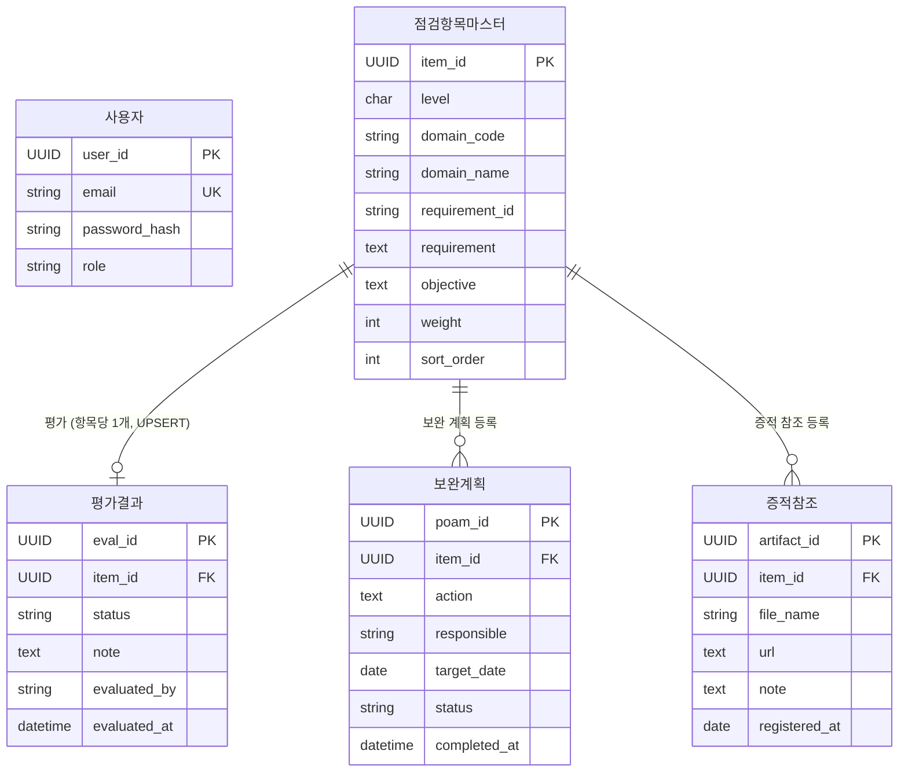
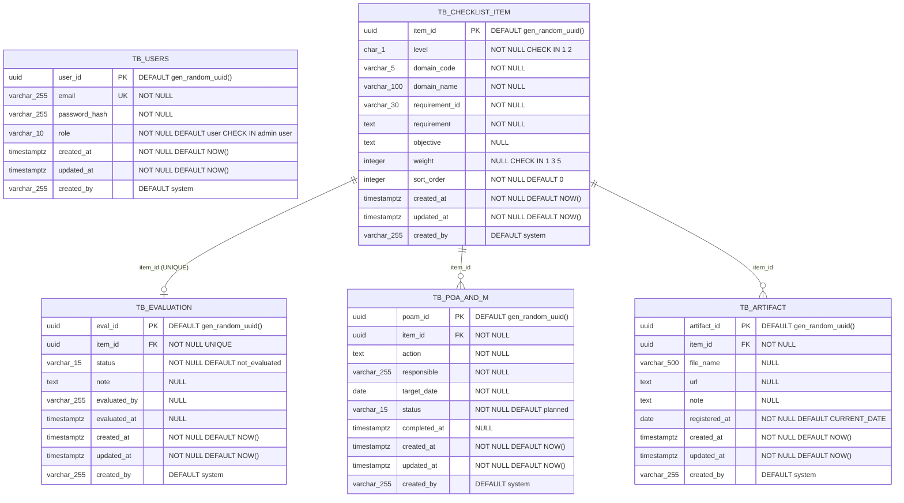

# 데이터 설계서

| 항목 | 내용 |
|:---|:---|
| 사업명 | CMMC 인증 준비 관리 시스템 |
| DB 종류 | PostgreSQL (Neon serverless, Vercel Storage) |
| 테이블 수 | 5개 |
| 작성 일시 | 2026-05-23 |
| 버전 | v0.1 |

---

## 1. 엔터티 목록

| 엔터티명 | 테이블명 | 설명 | 연계 UC |
|:---|:---|:---|:---|
| 사용자 | TB_USERS | 시스템 로그인 계정. 보안담당자·관리자 역할 구분 | UC-001 |
| 점검항목 마스터 | TB_CHECKLIST_ITEM | CMMC Level 1/2 점검항목 원본 데이터 (Seed 전용, 변경 없음) | UC-003, UC-004 |
| 평가 결과 | TB_EVALUATION | 점검항목별 MET/NOT MET/미평가 판정 및 노트 저장 | UC-003, UC-004 |
| 보완 계획 | TB_POA_AND_M | NOT MET 항목에 대한 POA&M 등록·상태 추적 | UC-006 |
| 증적 참조 | TB_ARTIFACT | 점검항목별 증적 파일명·URL 참조 정보 저장 | UC-007 |

---

## 2. 논리 ERD



**관계 설명:**
- `점검항목마스터` → `평가결과`: 1:0..1 (UNIQUE 제약 — 항목당 1개 평가, 재평가 시 UPDATE)
- `점검항목마스터` → `보완계획`: 1:N (동일 항목에 여러 보완 계획 이력 가능)
- `점검항목마스터` → `증적참조`: 1:N (동일 항목에 여러 증적 파일 등록 가능)
- `사용자`는 평가 실행 주체이나 평가결과의 `evaluated_by` 텍스트로 관리 (FK 불필요)

---

## 3. 물리 ERD



---

## 4. 테이블 정의서

### TB_USERS (사용자)

> 시스템 로그인 계정. NextAuth.js Credentials Provider와 연동. role 컬럼으로 보안담당자(user)와 관리자(admin)를 구분한다.

| 컬럼명 | 논리명 | 타입 | NOT NULL | PK | FK | 기본값 | 설명 |
|:---|:---|:---:|:---:|:---:|:---:|:---|:---|
| user_id | 사용자 ID | UUID | ✅ | ✅ | | gen_random_uuid() | 대리키 |
| email | 이메일 | VARCHAR(255) | ✅ | | | | UNIQUE. 로그인 식별자 |
| password_hash | 패스워드 해시 | VARCHAR(255) | ✅ | | | | bcrypt 해시 |
| role | 역할 | VARCHAR(10) | ✅ | | | 'user' | 'admin' 또는 'user' |
| created_at | 생성일시 | TIMESTAMPTZ | ✅ | | | NOW() | UTC 기준 |
| updated_at | 수정일시 | TIMESTAMPTZ | ✅ | | | NOW() | 트리거 자동 갱신 |
| created_by | 생성자 | VARCHAR(255) | ✅ | | | 'system' | 공통 감사 컬럼 |

**인덱스**

| 인덱스명 | 컬럼 | 유형 | 설명 |
|:---|:---|:---:|:---|
| PK_USERS | user_id | PRIMARY | 기본키 |
| UQ_USERS_EMAIL | email | UNIQUE | 이메일 중복 방지 |

---

### TB_CHECKLIST_ITEM (점검항목 마스터)

> CMMC Level 1(FAR 52.204-21) 및 Level 2(NIST SP 800-171A) 점검항목 원본 데이터. 시스템 초기 Seed 데이터로 삽입되며 운영 중 변경하지 않는다. Level 1: 58개 평가목표, Level 2: 110개 요구사항.

| 컬럼명 | 논리명 | 타입 | NOT NULL | PK | FK | 기본값 | 설명 |
|:---|:---|:---:|:---:|:---:|:---:|:---|:---|
| item_id | 항목 ID | UUID | ✅ | ✅ | | gen_random_uuid() | 대리키 |
| level | CMMC 레벨 | CHAR(1) | ✅ | | | | '1' = Level 1, '2' = Level 2 |
| domain_code | 도메인 코드 | VARCHAR(5) | ✅ | | | | AC/IA/MP/PE/SC/SI (L1), +AT/AU/CA/CM/IR/MA/PS/RA (L2) |
| domain_name | 도메인명 | VARCHAR(100) | ✅ | | | | 접근 통제, 식별 및 인증 등 |
| requirement_id | 요구사항 식별자 | VARCHAR(30) | ✅ | | | | 예: AC.L1-b.1.i, 3.1.1 |
| requirement | 요구사항 내용 | TEXT | ✅ | | | | FAR/NIST 원문 한국어 번역 |
| objective | 세부 평가목표 | TEXT | | | | NULL | Level 1 전용 세부 목표 기술 |
| weight | 가중치 | INTEGER | | | | NULL | Level 2 전용: 1·3·5점. Level 1은 NULL |
| sort_order | 정렬 순서 | INTEGER | ✅ | | | 0 | 화면 표시 순서 |
| created_at | 생성일시 | TIMESTAMPTZ | ✅ | | | NOW() | UTC 기준 |
| updated_at | 수정일시 | TIMESTAMPTZ | ✅ | | | NOW() | 트리거 자동 갱신 |
| created_by | 생성자 | VARCHAR(255) | ✅ | | | 'system' | 공통 감사 컬럼 |

**인덱스**

| 인덱스명 | 컬럼 | 유형 | 설명 |
|:---|:---|:---:|:---|
| PK_CHECKLIST_ITEM | item_id | PRIMARY | 기본키 |
| IDX_CHECKLIST_LEVEL | level | INDEX | Level 필터 조회 |
| IDX_CHECKLIST_DOMAIN | level, domain_code | INDEX | 도메인별 그룹 조회 (복합) |

---

### TB_EVALUATION (평가 결과)

> 점검항목별 AS-IS 평가 결과를 저장한다. UNIQUE(item_id) 제약으로 항목당 1개 평가만 유지하며, 재평가 시 UPDATE(UPSERT) 처리한다. 데이터 초기화(FR-013) 시 전체 삭제 대상이다.

| 컬럼명 | 논리명 | 타입 | NOT NULL | PK | FK | 기본값 | 설명 |
|:---|:---|:---:|:---:|:---:|:---:|:---|:---|
| eval_id | 평가 ID | UUID | ✅ | ✅ | | gen_random_uuid() | 대리키 |
| item_id | 항목 ID | UUID | ✅ | | TB_CHECKLIST_ITEM | | FK, UNIQUE 제약 |
| status | 평가 상태 | VARCHAR(15) | ✅ | | | 'not_evaluated' | met / not_met / not_evaluated |
| note | 평가 노트 | TEXT | | | | NULL | 자유 텍스트 메모 |
| evaluated_by | 평가자 | VARCHAR(255) | | | | NULL | 평가자 이메일 또는 이름 |
| evaluated_at | 평가일시 | TIMESTAMPTZ | | | | NULL | 평가 수행 일시 |
| created_at | 생성일시 | TIMESTAMPTZ | ✅ | | | NOW() | UTC 기준 |
| updated_at | 수정일시 | TIMESTAMPTZ | ✅ | | | NOW() | 트리거 자동 갱신 |
| created_by | 생성자 | VARCHAR(255) | ✅ | | | 'system' | 공통 감사 컬럼 |

**인덱스**

| 인덱스명 | 컬럼 | 유형 | 설명 |
|:---|:---|:---:|:---|
| PK_EVALUATION | eval_id | PRIMARY | 기본키 |
| UQ_EVALUATION_ITEM | item_id | UNIQUE | 항목당 1개 평가 보장 |
| IDX_EVALUATION_STATUS | status | INDEX | 갭 분석(NOT MET 필터) 조회 |

---

### TB_POA_AND_M (보완 계획)

> NOT MET 항목에 대한 보완 계획(Plan of Action & Milestones)을 등록·추적한다. Level 2는 POA&M을 통한 180일 내 시정이 허용되나, Level 1 항목의 POA&M 등록은 애플리케이션 레벨에서 차단한다. 데이터 초기화 시 전체 삭제 대상이다.

| 컬럼명 | 논리명 | 타입 | NOT NULL | PK | FK | 기본값 | 설명 |
|:---|:---|:---:|:---:|:---:|:---:|:---|:---|
| poam_id | POA&M ID | UUID | ✅ | ✅ | | gen_random_uuid() | 대리키 |
| item_id | 항목 ID | UUID | ✅ | | TB_CHECKLIST_ITEM | | FK |
| action | 조치 내용 | TEXT | ✅ | | | | 보완 조치 상세 내용 |
| responsible | 책임자 | VARCHAR(255) | ✅ | | | | 책임자 이름 또는 이메일 |
| target_date | 목표 완료일 | DATE | ✅ | | | | 오늘 이후 날짜 (앱 레벨 검증) |
| status | 진행 상태 | VARCHAR(15) | ✅ | | | 'planned' | planned / in_progress / completed |
| completed_at | 완료일시 | TIMESTAMPTZ | | | | NULL | 상태 → completed 시 자동 기록 |
| created_at | 생성일시 | TIMESTAMPTZ | ✅ | | | NOW() | UTC 기준 |
| updated_at | 수정일시 | TIMESTAMPTZ | ✅ | | | NOW() | 트리거 자동 갱신 |
| created_by | 생성자 | VARCHAR(255) | ✅ | | | 'system' | 공통 감사 컬럼 |

**인덱스**

| 인덱스명 | 컬럼 | 유형 | 설명 |
|:---|:---|:---:|:---|
| PK_POA_AND_M | poam_id | PRIMARY | 기본키 |
| IDX_POAM_ITEM | item_id | INDEX | 항목별 POA&M 조회 |
| IDX_POAM_STATUS | status | INDEX | 상태별 필터 조회 |
| IDX_POAM_TARGET | target_date | INDEX | 마감일 기준 정렬 조회 |

---

### TB_ARTIFACT (증적 참조)

> 점검항목별 증적(Artifact) 파일명 또는 URL을 참조 정보로 저장한다. 실제 파일 바이너리는 저장하지 않는다. file_name 또는 url 중 하나 이상 필수(CHECK 제약). 데이터 초기화 시 전체 삭제 대상이다.

| 컬럼명 | 논리명 | 타입 | NOT NULL | PK | FK | 기본값 | 설명 |
|:---|:---|:---:|:---:|:---:|:---:|:---|:---|
| artifact_id | 증적 ID | UUID | ✅ | ✅ | | gen_random_uuid() | 대리키 |
| item_id | 항목 ID | UUID | ✅ | | TB_CHECKLIST_ITEM | | FK |
| file_name | 파일명 | VARCHAR(500) | | | | NULL | 예: AC.L1-b.1.i_ACL_20260523.png |
| url | URL | TEXT | | | | NULL | 증적 파일 URL 또는 문서 링크 |
| note | 비고 | TEXT | | | | NULL | 증적 설명 |
| registered_at | 등록일 | DATE | ✅ | | | CURRENT_DATE | 증적 등록 기준일 |
| created_at | 생성일시 | TIMESTAMPTZ | ✅ | | | NOW() | UTC 기준 |
| updated_at | 수정일시 | TIMESTAMPTZ | ✅ | | | NOW() | 트리거 자동 갱신 |
| created_by | 생성자 | VARCHAR(255) | ✅ | | | 'system' | 공통 감사 컬럼 |

> **CHECK 제약**: `file_name IS NOT NULL OR url IS NOT NULL` (둘 중 하나 이상 필수)

**인덱스**

| 인덱스명 | 컬럼 | 유형 | 설명 |
|:---|:---|:---:|:---|
| PK_ARTIFACT | artifact_id | PRIMARY | 기본키 |
| IDX_ARTIFACT_ITEM | item_id | INDEX | 항목별 증적 조회 |

---

## 5. 관계 정의

| 부모 테이블 | 자식 테이블 | 관계 유형 | FK 컬럼 | 참조 무결성 |
|:---|:---|:---:|:---|:---|
| TB_CHECKLIST_ITEM | TB_EVALUATION | 1:0..1 | item_id (UNIQUE) | ON DELETE CASCADE |
| TB_CHECKLIST_ITEM | TB_POA_AND_M | 1:N | item_id | ON DELETE CASCADE |
| TB_CHECKLIST_ITEM | TB_ARTIFACT | 1:N | item_id | ON DELETE CASCADE |

> **ON DELETE CASCADE**: 점검항목 마스터 삭제 시 연관 데이터 자동 삭제. 단, Seed 전용 테이블이므로 운영 중 삭제 없음.

---

## 6. 공통 코드 목록

| 코드 그룹 | 코드 그룹명 | 코드값 | 코드명 | 비고 |
|:---|:---|:---|:---|:---|
| CMMC_LEVEL | CMMC 레벨 | 1 | CMMC Level 1 | FAR 52.204-21, FCI 취급 |
| CMMC_LEVEL | CMMC 레벨 | 2 | CMMC Level 2 | NIST SP 800-171A, CUI 취급 |
| EVAL_STATUS | 평가 상태 | met | MET (이행) | 완전 이행 |
| EVAL_STATUS | 평가 상태 | not_met | NOT MET (미이행) | 미충족, 갭 분석 대상 |
| EVAL_STATUS | 평가 상태 | not_evaluated | 미평가 | 초기 상태 |
| POAM_STATUS | POA&M 상태 | planned | 계획중 | POA&M 등록 초기 |
| POAM_STATUS | POA&M 상태 | in_progress | 진행중 | 조치 중 |
| POAM_STATUS | POA&M 상태 | completed | 완료 | 보완 조치 완료 |
| USER_ROLE | 사용자 역할 | admin | 관리자 | 전체 기능 + 초기화 권한 |
| USER_ROLE | 사용자 역할 | user | 보안담당자 | 평가·POA&M·증적 등록 |
| ITEM_WEIGHT | SPRS 가중치 | 1 | 1점 | Level 2 경미한 미충족 |
| ITEM_WEIGHT | SPRS 가중치 | 3 | 3점 | Level 2 중간 미충족 |
| ITEM_WEIGHT | SPRS 가중치 | 5 | 5점 | Level 2 중대 미충족 (POA&M 불가) |
| DOMAIN_L1 | Level 1 도메인 | AC | 접근 통제 | Access Control |
| DOMAIN_L1 | Level 1 도메인 | IA | 식별 및 인증 | Identification & Authentication |
| DOMAIN_L1 | Level 1 도메인 | MP | 매체 보호 | Media Protection |
| DOMAIN_L1 | Level 1 도메인 | PE | 물리적 보호 | Physical Protection |
| DOMAIN_L1 | Level 1 도메인 | SC | 시스템/통신 보호 | System & Comm. Protection |
| DOMAIN_L1 | Level 1 도메인 | SI | 시스템/정보 무결성 | System & Info. Integrity |

---

## 7. DDL 초안

```sql
-- ============================================================
-- CMMC 인증 준비 관리 시스템 DDL 초안
-- DB: PostgreSQL (Neon serverless)
-- 작성일: 2026-05-23
-- ============================================================

-- 1. 사용자 (TB_USERS)
-- Drizzle ORM 실제 테이블명: users
CREATE TABLE TB_USERS (
    user_id     UUID          PRIMARY KEY DEFAULT gen_random_uuid(),
    email       VARCHAR(255)  NOT NULL UNIQUE,
    password_hash VARCHAR(255) NOT NULL,
    role        VARCHAR(10)   NOT NULL DEFAULT 'user'
                              CHECK (role IN ('admin', 'user')),
    created_at  TIMESTAMPTZ   NOT NULL DEFAULT NOW(),
    updated_at  TIMESTAMPTZ   NOT NULL DEFAULT NOW(),
    created_by  VARCHAR(255)  NOT NULL DEFAULT 'system'
);

COMMENT ON TABLE  TB_USERS          IS '사용자';
COMMENT ON COLUMN TB_USERS.role     IS 'admin: 관리자, user: 보안담당자';

-- 2. 점검항목 마스터 (TB_CHECKLIST_ITEM)
-- Drizzle ORM 실제 테이블명: checklist_items
CREATE TABLE TB_CHECKLIST_ITEM (
    item_id        UUID          PRIMARY KEY DEFAULT gen_random_uuid(),
    level          CHAR(1)       NOT NULL CHECK (level IN ('1', '2')),
    domain_code    VARCHAR(5)    NOT NULL,
    domain_name    VARCHAR(100)  NOT NULL,
    requirement_id VARCHAR(30)   NOT NULL,
    requirement    TEXT          NOT NULL,
    objective      TEXT,
    weight         INTEGER       CHECK (weight IN (1, 3, 5)),
    sort_order     INTEGER       NOT NULL DEFAULT 0,
    created_at     TIMESTAMPTZ   NOT NULL DEFAULT NOW(),
    updated_at     TIMESTAMPTZ   NOT NULL DEFAULT NOW(),
    created_by     VARCHAR(255)  NOT NULL DEFAULT 'system'
);

COMMENT ON TABLE  TB_CHECKLIST_ITEM         IS '점검항목 마스터 (CMMC Level 1/2)';
COMMENT ON COLUMN TB_CHECKLIST_ITEM.level   IS '1: CMMC Level 1, 2: CMMC Level 2';
COMMENT ON COLUMN TB_CHECKLIST_ITEM.weight  IS 'Level 2 SPRS 가중치(1·3·5점). Level 1은 NULL';
COMMENT ON COLUMN TB_CHECKLIST_ITEM.objective IS 'Level 1 세부 평가목표 (58개)';

CREATE INDEX IDX_CHECKLIST_LEVEL  ON TB_CHECKLIST_ITEM (level);
CREATE INDEX IDX_CHECKLIST_DOMAIN ON TB_CHECKLIST_ITEM (level, domain_code);

-- 3. 평가 결과 (TB_EVALUATION)
-- Drizzle ORM 실제 테이블명: evaluations
CREATE TABLE TB_EVALUATION (
    eval_id      UUID          PRIMARY KEY DEFAULT gen_random_uuid(),
    item_id      UUID          NOT NULL UNIQUE
                               REFERENCES TB_CHECKLIST_ITEM(item_id)
                               ON DELETE CASCADE,
    status       VARCHAR(15)   NOT NULL DEFAULT 'not_evaluated'
                               CHECK (status IN ('met', 'not_met', 'not_evaluated')),
    note         TEXT,
    evaluated_by VARCHAR(255),
    evaluated_at TIMESTAMPTZ,
    created_at   TIMESTAMPTZ   NOT NULL DEFAULT NOW(),
    updated_at   TIMESTAMPTZ   NOT NULL DEFAULT NOW(),
    created_by   VARCHAR(255)  NOT NULL DEFAULT 'system'
);
-- item_id UNIQUE → 점검항목당 1개 평가. 재평가 시 UPDATE(UPSERT)

COMMENT ON TABLE  TB_EVALUATION        IS '평가 결과 (MET/NOT MET/미평가)';
COMMENT ON COLUMN TB_EVALUATION.status IS 'met: MET, not_met: NOT MET, not_evaluated: 미평가';

CREATE INDEX IDX_EVALUATION_STATUS ON TB_EVALUATION (status);

-- 4. POA&M 보완 계획 (TB_POA_AND_M)
-- Drizzle ORM 실제 테이블명: poa_and_m
CREATE TABLE TB_POA_AND_M (
    poam_id      UUID          PRIMARY KEY DEFAULT gen_random_uuid(),
    item_id      UUID          NOT NULL
                               REFERENCES TB_CHECKLIST_ITEM(item_id)
                               ON DELETE CASCADE,
    action       TEXT          NOT NULL,
    responsible  VARCHAR(255)  NOT NULL,
    target_date  DATE          NOT NULL,
    status       VARCHAR(15)   NOT NULL DEFAULT 'planned'
                               CHECK (status IN ('planned', 'in_progress', 'completed')),
    completed_at TIMESTAMPTZ,
    created_at   TIMESTAMPTZ   NOT NULL DEFAULT NOW(),
    updated_at   TIMESTAMPTZ   NOT NULL DEFAULT NOW(),
    created_by   VARCHAR(255)  NOT NULL DEFAULT 'system'
);

COMMENT ON TABLE  TB_POA_AND_M              IS 'POA&M (Plan of Action & Milestones, 보완 계획)';
COMMENT ON COLUMN TB_POA_AND_M.status       IS 'planned: 계획중, in_progress: 진행중, completed: 완료';
COMMENT ON COLUMN TB_POA_AND_M.completed_at IS 'status=completed 변경 시 자동 기록 (앱 레벨 처리)';

CREATE INDEX IDX_POAM_ITEM        ON TB_POA_AND_M (item_id);
CREATE INDEX IDX_POAM_STATUS      ON TB_POA_AND_M (status);
CREATE INDEX IDX_POAM_TARGET_DATE ON TB_POA_AND_M (target_date);

-- 5. 증적 참조 (TB_ARTIFACT)
-- Drizzle ORM 실제 테이블명: artifacts
CREATE TABLE TB_ARTIFACT (
    artifact_id   UUID         PRIMARY KEY DEFAULT gen_random_uuid(),
    item_id       UUID         NOT NULL
                               REFERENCES TB_CHECKLIST_ITEM(item_id)
                               ON DELETE CASCADE,
    file_name     VARCHAR(500),
    url           TEXT,
    note          TEXT,
    registered_at DATE         NOT NULL DEFAULT CURRENT_DATE,
    created_at    TIMESTAMPTZ  NOT NULL DEFAULT NOW(),
    updated_at    TIMESTAMPTZ  NOT NULL DEFAULT NOW(),
    created_by    VARCHAR(255) NOT NULL DEFAULT 'system',
    CONSTRAINT chk_artifact_ref CHECK (file_name IS NOT NULL OR url IS NOT NULL)
);

COMMENT ON TABLE  TB_ARTIFACT           IS '증적 참조 (파일명 또는 URL 중 하나 이상 필수)';
COMMENT ON COLUMN TB_ARTIFACT.file_name IS '예: AC.L1-b.1.i_ActiveDirectory_ACL_20260523.png';

CREATE INDEX IDX_ARTIFACT_ITEM ON TB_ARTIFACT (item_id);

-- ============================================================
-- updated_at 자동 갱신 트리거
-- ============================================================
CREATE OR REPLACE FUNCTION fn_update_updated_at()
RETURNS TRIGGER AS $$
BEGIN
    NEW.updated_at = NOW();
    RETURN NEW;
END;
$$ LANGUAGE plpgsql;

CREATE TRIGGER trg_users_updated_at
    BEFORE UPDATE ON TB_USERS
    FOR EACH ROW EXECUTE FUNCTION fn_update_updated_at();

CREATE TRIGGER trg_checklist_updated_at
    BEFORE UPDATE ON TB_CHECKLIST_ITEM
    FOR EACH ROW EXECUTE FUNCTION fn_update_updated_at();

CREATE TRIGGER trg_evaluation_updated_at
    BEFORE UPDATE ON TB_EVALUATION
    FOR EACH ROW EXECUTE FUNCTION fn_update_updated_at();

CREATE TRIGGER trg_poam_updated_at
    BEFORE UPDATE ON TB_POA_AND_M
    FOR EACH ROW EXECUTE FUNCTION fn_update_updated_at();

CREATE TRIGGER trg_artifact_updated_at
    BEFORE UPDATE ON TB_ARTIFACT
    FOR EACH ROW EXECUTE FUNCTION fn_update_updated_at();
```

> **Drizzle ORM 실제 테이블명**: Drizzle ORM 스키마(`src/db/schema.ts`)에서는 PostgreSQL 관례에 따라 소문자 스네이크케이스를 사용한다.
> - `TB_USERS` → `users`
> - `TB_CHECKLIST_ITEM` → `checklist_items`
> - `TB_EVALUATION` → `evaluations`
> - `TB_POA_AND_M` → `poa_and_m`
> - `TB_ARTIFACT` → `artifacts`

---

## 8. 데이터 표준

| 항목 | 규칙 |
|:---|:---|
| 테이블명 (설계서) | `TB_대문자_스네이크케이스` (예: `TB_CHECKLIST_ITEM`) |
| 테이블명 (Drizzle ORM) | `소문자_스네이크케이스` (예: `checklist_items`) |
| 컬럼명 | `소문자_스네이크케이스` (예: `domain_code`) |
| PK 컬럼명 | `{테이블약어}_id` (UUID, gen_random_uuid()) |
| FK 컬럼명 | 참조 테이블 PK명과 동일 (예: `item_id`) |
| 날짜/시간 | `TIMESTAMPTZ` (UTC 기준, Neon PostgreSQL 권장) |
| 날짜만 | `DATE` (target_date, registered_at) |
| 공통 컬럼 | `created_at`, `updated_at`, `created_by` 모든 테이블 포함 |
| ENUM 처리 | PostgreSQL CHECK 제약 사용 (별도 ENUM 타입 미사용) |
| PK 전략 | UUID 대리키 (`gen_random_uuid()`) |
| 삭제 전략 | 물리 삭제 (`DELETE`) 사용. 소프트 삭제 미적용 (재평가 시 UPDATE) |
| 시드 데이터 | `TB_CHECKLIST_ITEM`은 JSON → Seed 스크립트로 삽입, 운영 중 변경 없음 |

---

## 문서 버전 이력

| 버전 | 일자 | 작성자 | 변경 내용 |
|:---|:---|:---|:---|
| v0.1 | 2026-05-23 | 초안 작성 | 최초 생성 |
