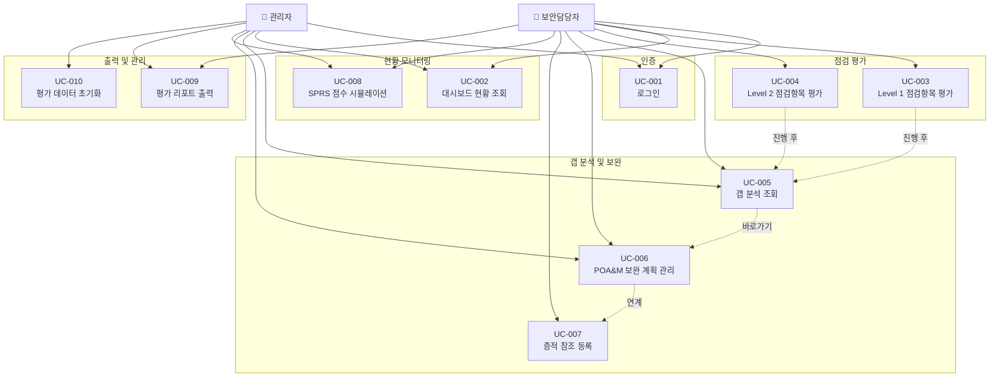

# 유즈케이스 문서

| 항목 | 내용 |
|:---|:---|
| 사업명 | CMMC 인증 준비 관리 시스템 |
| 분석 범위 | FR-001 ~ FR-013 (기능 요구사항 전체), SR-001·SR-003 (인증·접근통제) |
| UC 총 건수 | 10건 |
| FR 연계 건수 | 13건 |
| 작성 일시 | 2026-05-23 |
| 버전 | v0.1 |

---

## 1. 액터 목록

| 액터명 | 유형 | 역할 설명 | 관련 UC |
|:---|:---:|:---|:---|
| 보안담당자 | 사람 | CMMC 점검항목을 직접 평가하고, 갭 분석·POA&M·증적 등록을 수행하는 주 사용자 | UC-001 ~ UC-009 |
| 관리자 | 사람 | 보안담당자 권한 포함. 평가 데이터 초기화 및 전체 리포트 관리 가능 | UC-001 ~ UC-010 |
| 시스템 | 시스템 | 점수 계산(SPRS), 진행률 집계, 자동 저장 등 내부 처리를 수행하는 서버 컴포넌트 | UC-002, UC-004, UC-008 |

---

## 2. 유즈케이스 목록

| UC-ID | 유즈케이스명 | 주요 액터 | 연관 FR | SC-ID | 우선순위 |
|:---|:---|:---|:---|:---|:---:|
| UC-001 | 로그인 | 보안담당자, 관리자 | SR-001, SR-003 | — | 상 |
| UC-002 | 대시보드 현황 조회 | 보안담당자, 관리자, 시스템 | FR-009, FR-012 | — | 상 |
| UC-003 | Level 1 점검항목 평가 | 보안담당자 | FR-001, FR-002, FR-004, FR-005, FR-012 | — | 상 |
| UC-004 | Level 2 점검항목 평가 | 보안담당자, 시스템 | FR-001, FR-003, FR-004, FR-005, FR-012 | — | 상 |
| UC-005 | 갭 분석 조회 | 보안담당자, 관리자 | FR-006 | — | 상 |
| UC-006 | POA&M 보완 계획 관리 | 보안담당자, 관리자 | FR-007 | — | 상 |
| UC-007 | 증적 참조 등록 | 보안담당자 | FR-008 | — | 중 |
| UC-008 | SPRS 점수 시뮬레이션 | 보안담당자, 관리자, 시스템 | FR-010 | — | 상 |
| UC-009 | 평가 리포트 출력 | 보안담당자, 관리자 | FR-011, IR-002 | — | 중 |
| UC-010 | 평가 데이터 초기화 | 관리자 | FR-013 | — | 하 |

---

## 3. 유즈케이스 상세

### UC-001: 로그인

| 항목 | 내용 |
|:---|:---|
| 액터 | 보안담당자, 관리자 |
| 사전 조건 | 시스템에 등록된 계정(ID/PW)이 존재한다 |
| 사후 조건 | 인증 세션이 생성되고, 대시보드 페이지로 이동한다 |
| 연관 FR | SR-001 (기본 사용자 인증), SR-003 (평가 데이터 접근 통제) |

**기본 흐름 (주요 성공 시나리오)**

| 단계 | 액터/시스템 | 처리 내용 |
|:---:|:---:|:---|
| 1 | 액터 | 브라우저에서 시스템 URL 접속 → 로그인 페이지 표시 |
| 2 | 액터 | ID(이메일)와 패스워드 입력 후 로그인 버튼 클릭 |
| 3 | 시스템 | 입력값 유효성 검사 (필수 필드 확인) |
| 4 | 시스템 | NextAuth.js Credentials Provider로 자격증명 검증 |
| 5 | 시스템 | 인증 성공 시 세션 쿠키 발급 |
| 6 | 시스템 | 대시보드(`/dashboard`) 페이지로 리다이렉트 |

**대안 흐름**

- **A1. 이미 로그인된 상태**: 로그인 페이지 접속 시 대시보드로 자동 리다이렉트
- **A2. 보호된 페이지 직접 접근**: 미인증 상태로 `/dashboard` 등 접근 시 `/login`으로 리다이렉트 (Next.js 미들웨어 처리)

**예외 흐름**

| 예외 조건 | 처리 내용 |
|:---|:---|
| 잘못된 ID 또는 패스워드 입력 | "이메일 또는 패스워드가 올바르지 않습니다." 오류 메시지 표시, 로그인 페이지 유지 |
| 필수 필드 미입력 | 필드별 유효성 오류 메시지 표시 |
| 서버 오류 | "일시적인 오류가 발생했습니다. 잠시 후 다시 시도해 주세요." 표시 |

---

### UC-002: 대시보드 현황 조회

| 항목 | 내용 |
|:---|:---|
| 액터 | 보안담당자, 관리자, 시스템 |
| 사전 조건 | 로그인 상태이다 |
| 사후 조건 | 최신 평가 현황(달성률, 도메인별 차트, NOT MET 수, 진행률)이 화면에 표시된다 |
| 연관 FR | FR-009 (진행 현황 대시보드), FR-012 (점검 진행률 표시) |

**기본 흐름 (주요 성공 시나리오)**

| 단계 | 액터/시스템 | 처리 내용 |
|:---:|:---:|:---|
| 1 | 액터 | 대시보드 메뉴 클릭 또는 로그인 후 자동 이동 |
| 2 | 시스템 | Level 1 평가 현황 집계: 전체 15개 요구사항 대비 MET/NOT MET/미평가 수 계산 |
| 3 | 시스템 | Level 2 평가 현황 집계: 14개 도메인별 MET 비율 계산 |
| 4 | 시스템 | 전체 점검 진행률(완료 항목 / 전체 항목) 계산 |
| 5 | 시스템 | 달성률 수치 카드, 도메인별 막대차트(Recharts), Progress Bar 렌더링 |
| 6 | 액터 | 화면에서 CMMC 준비 현황 확인 |

**대안 흐름**

- **A1. 평가 미수행 상태**: 모든 수치가 0%로 표시되며 "점검을 시작하려면 Level 1 또는 Level 2 평가 메뉴로 이동하세요." 안내 표시
- **A2. Level 1만 평가 완료**: Level 1 현황만 채워지고 Level 2는 0% 상태로 표시

**예외 흐름**

| 예외 조건 | 처리 내용 |
|:---|:---|
| DB 연결 오류 | "데이터를 불러오지 못했습니다. 잠시 후 다시 시도해 주세요." 표시 |
| 집계 데이터 없음 | 빈 상태 UI(Empty State) 표시 및 평가 시작 버튼 제공 |

---

### UC-003: Level 1 점검항목 평가

| 항목 | 내용 |
|:---|:---|
| 액터 | 보안담당자 |
| 사전 조건 | 로그인 상태이다. Level 1 탭이 선택되어 있다 |
| 사후 조건 | 입력한 MET/NOT MET 판정과 노트가 DB에 저장된다. 진행률이 갱신된다 |
| 연관 FR | FR-001 (Level 선택), FR-002 (Level 1 조회), FR-004 (평가 입력), FR-005 (노트 입력), FR-012 (진행률) |

**기본 흐름 (주요 성공 시나리오)**

| 단계 | 액터/시스템 | 처리 내용 |
|:---:|:---:|:---|
| 1 | 액터 | 상단 탭에서 "Level 1" 선택 |
| 2 | 시스템 | 6개 도메인(AC, IA, MP, PE, SC, SI)별로 그룹화된 15개 요구사항 / 58개 평가목표 목록 표시 |
| 3 | 시스템 | 기존 저장된 평가 결과 있으면 해당 상태(MET/NOT MET/미평가) 미리 표시 |
| 4 | 액터 | 점검항목별 MET / NOT MET / 미평가 라디오 버튼 선택 |
| 5 | 액터 | (선택) 평가 노트 텍스트 입력 |
| 6 | 시스템 | 변경 즉시 자동 저장(debounce) 또는 "저장" 버튼 클릭 시 저장 |
| 7 | 시스템 | 진행률 Progress Bar 갱신 |
| 8 | 시스템 | 저장 완료 토스트 알림 표시 |

**대안 흐름**

- **A1. 도메인 필터 적용**: 특정 도메인만 필터링하여 해당 도메인 항목만 표시
- **A2. 이미 평가된 항목 재평가**: 기존 결과를 덮어쓰기, 이전 결과 대비 변경 표시

**예외 흐름**

| 예외 조건 | 처리 내용 |
|:---|:---|
| 저장 실패 (네트워크 오류) | "저장에 실패했습니다. 재시도합니다." 오류 토스트 표시 |
| 점검항목 마스터 데이터 없음 | "점검항목 데이터를 불러올 수 없습니다." 오류 메시지 표시 |

---

### UC-004: Level 2 점검항목 평가

| 항목 | 내용 |
|:---|:---|
| 액터 | 보안담당자, 시스템 |
| 사전 조건 | 로그인 상태이다. Level 2 탭이 선택되어 있다 |
| 사후 조건 | 입력한 MET/NOT MET 판정과 노트가 DB에 저장된다. SPRS 점수가 자동 갱신된다 |
| 연관 FR | FR-001 (Level 선택), FR-003 (Level 2 조회), FR-004 (평가 입력), FR-005 (노트 입력), FR-012 (진행률) |

**기본 흐름 (주요 성공 시나리오)**

| 단계 | 액터/시스템 | 처리 내용 |
|:---:|:---:|:---|
| 1 | 액터 | 상단 탭에서 "Level 2" 선택 |
| 2 | 시스템 | 14개 도메인(AC, AT, AU, CA, CM, IA, IR, MA, MP, PE, PS, RA, SC, SI)별 110개 요구사항 목록 표시. 각 항목에 가중치(1/3/5점) 뱃지 표시 |
| 3 | 시스템 | 기존 저장된 평가 결과 미리 표시 |
| 4 | 액터 | 점검항목별 MET / NOT MET / 미평가 선택 |
| 5 | 액터 | (선택) 평가 노트 입력 |
| 6 | 시스템 | 자동 저장 또는 명시적 저장 |
| 7 | 시스템 | NOT MET 항목 가중치 합산 → SPRS 예상 점수 즉시 갱신 표시 |
| 8 | 시스템 | 진행률 Progress Bar 갱신 |

**대안 흐름**

- **A1. 도메인별 탭/필터 사용**: 14개 도메인 중 하나를 선택하여 해당 도메인 항목만 표시
- **A2. 가중치 5점 항목 필터**: "핵심 항목만 보기" 필터 적용 시 가중치 5점 NOT MET 항목만 하이라이트

**예외 흐름**

| 예외 조건 | 처리 내용 |
|:---|:---|
| 저장 실패 | "저장에 실패했습니다." 오류 토스트 표시, 입력값 보존 |
| 점검항목 110개 미만 로딩 | "일부 항목을 불러오지 못했습니다." 경고 표시 |

---

### UC-005: 갭 분석 조회

| 항목 | 내용 |
|:---|:---|
| 액터 | 보안담당자, 관리자 |
| 사전 조건 | 로그인 상태이다. 최소 1개 이상의 평가 결과가 존재한다 |
| 사후 조건 | NOT MET 항목 목록이 도메인별로 분류되어 화면에 표시된다 |
| 연관 FR | FR-006 (갭 분석 조회) |

**기본 흐름 (주요 성공 시나리오)**

| 단계 | 액터/시스템 | 처리 내용 |
|:---:|:---:|:---|
| 1 | 액터 | 사이드바에서 "갭 분석" 메뉴 클릭 |
| 2 | 액터 | Level 1 / Level 2 / 전체 필터 선택 |
| 3 | 시스템 | 선택된 레벨의 NOT MET 항목만 필터링하여 조회 |
| 4 | 시스템 | 도메인별로 그룹화하여 NOT MET 항목 목록 표시 (도메인명, 요구사항 ID, 요구사항 내용, 가중치) |
| 5 | 시스템 | 각 항목 옆에 "POA&M 등록" 바로가기 버튼 표시 |
| 6 | 액터 | NOT MET 항목 목록 검토 후 POA&M 등록 또는 재평가 진행 |

**대안 흐름**

- **A1. NOT MET 항목 없음**: "모든 항목이 MET 상태입니다. CMMC 인증 준비 완료!" 메시지 표시
- **A2. 특정 도메인만 조회**: 도메인 드롭다운 필터로 특정 도메인 NOT MET 항목만 표시

**예외 흐름**

| 예외 조건 | 처리 내용 |
|:---|:---|
| 평가 미수행 상태 | "아직 평가된 항목이 없습니다. 먼저 점검을 수행해 주세요." 안내 및 평가 메뉴 링크 제공 |

---

### UC-006: POA&M 보완 계획 관리

| 항목 | 내용 |
|:---|:---|
| 액터 | 보안담당자, 관리자 |
| 사전 조건 | 로그인 상태이다. NOT MET 평가 항목이 1개 이상 존재한다 |
| 사후 조건 | POA&M 항목이 등록·수정 또는 상태가 업데이트된다 |
| 연관 FR | FR-007 (POA&M 등록 및 관리) |

**기본 흐름 (주요 성공 시나리오)**

| 단계 | 액터/시스템 | 처리 내용 |
|:---:|:---:|:---|
| 1 | 액터 | POA&M 메뉴 클릭 또는 갭 분석 화면에서 "POA&M 등록" 버튼 클릭 |
| 2 | 시스템 | POA&M 등록 폼 표시 (연결된 점검항목 ID 자동 입력) |
| 3 | 액터 | 조치 내용, 책임자, 목표 완료일, 현재 상태(계획중/진행중/완료) 입력 |
| 4 | 액터 | 저장 버튼 클릭 |
| 5 | 시스템 | 유효성 검사 (목표 완료일 필수, 미래 날짜 여부) |
| 6 | 시스템 | POA&M 항목 저장 후 목록 화면에 상태 배지와 함께 표시 |
| 7 | 액터 | POA&M 목록에서 진행 상황 확인 및 상태 업데이트 (계획중 → 진행중 → 완료) |

**대안 흐름**

- **A1. Level 1 항목에 POA&M 등록 시도**: "Level 1은 POA&M이 허용되지 않습니다. 즉각적인 시정 조치가 필요합니다." 경고 표시 후 등록 차단
- **A2. 기존 POA&M 수정**: 목록에서 "수정" 클릭 → 편집 폼 표시, 저장 시 기존 내용 덮어쓰기
- **A3. POA&M 완료 처리**: 상태를 "완료"로 변경 시 완료일 자동 기록

**예외 흐름**

| 예외 조건 | 처리 내용 |
|:---|:---|
| 목표 완료일 미입력 | "목표 완료일은 필수 입력 항목입니다." 유효성 오류 표시 |
| 목표 완료일이 과거 날짜 | "목표 완료일은 오늘 이후 날짜를 선택하세요." 경고 표시 |
| 저장 실패 | "저장에 실패했습니다." 오류 토스트 표시, 입력값 보존 |

---

### UC-007: 증적 참조 등록

| 항목 | 내용 |
|:---|:---|
| 액터 | 보안담당자 |
| 사전 조건 | 로그인 상태이다 |
| 사후 조건 | 증적 참조 정보(파일명, URL, 비고)가 해당 점검항목에 연결되어 저장된다 |
| 연관 FR | FR-008 (증적 참조 등록) |

**기본 흐름 (주요 성공 시나리오)**

| 단계 | 액터/시스템 | 처리 내용 |
|:---:|:---:|:---|
| 1 | 액터 | 점검항목 행에서 "증적 등록" 버튼 클릭 (또는 증적 관리 메뉴 접근) |
| 2 | 시스템 | 증적 등록 슬라이드 패널 또는 모달 표시 |
| 3 | 액터 | 증적 파일명, 증적 URL(선택), 등록일(기본: 오늘), 비고 입력 |
| 4 | 액터 | 저장 버튼 클릭 |
| 5 | 시스템 | 증적 정보 저장 |
| 6 | 시스템 | 해당 점검항목 행에 증적 아이콘(페이퍼클립 등) 뱃지 표시 |

**대안 흐름**

- **A1. URL만 입력**: 파일명 없이 URL만 입력하여 저장 가능
- **A2. 다수의 증적 등록**: 동일 점검항목에 여러 증적을 등록 가능 (목록으로 관리)

**예외 흐름**

| 예외 조건 | 처리 내용 |
|:---|:---|
| 파일명과 URL 모두 미입력 | "파일명 또는 URL 중 하나는 반드시 입력해야 합니다." 유효성 오류 표시 |
| 잘못된 URL 형식 | "URL 형식이 올바르지 않습니다." 경고 표시 (저장은 허용) |

---

### UC-008: SPRS 점수 시뮬레이션

| 항목 | 내용 |
|:---|:---|
| 액터 | 보안담당자, 관리자, 시스템 |
| 사전 조건 | 로그인 상태이다. Level 2 평가 결과가 1개 이상 존재한다 |
| 사후 조건 | 현재 평가 결과 기반 SPRS 예상 점수(−203 ~ 110)가 화면에 표시된다 |
| 연관 FR | FR-010 (SPRS 점수 시뮬레이터) |

**기본 흐름 (주요 성공 시나리오)**

| 단계 | 액터/시스템 | 처리 내용 |
|:---:|:---:|:---|
| 1 | 액터 | 대시보드의 SPRS 점수 카드 또는 별도 SPRS 시뮬레이터 페이지 접근 |
| 2 | 시스템 | Level 2 NOT MET 항목 목록 조회 |
| 3 | 시스템 | 각 NOT MET 항목의 가중치(1점/3점/5점) 합산 → 감점 계산 |
| 4 | 시스템 | SPRS 예상 점수 = 110 − 감점 합산으로 계산 |
| 5 | 시스템 | SPRS 점수 수치와 시각적 게이지(−203 ~ 110 범위) 표시 |
| 6 | 시스템 | 가중치 5점 미충족 항목 (POA&M 불가, 즉시 시정 필요) 별도 하이라이트 표시 |

**대안 흐름**

- **A1. 모든 항목 MET**: "SPRS 점수: 110점 (만점)" 표시 및 인증 준비 완료 안내
- **A2. 실시간 반영**: Level 2 점검항목 평가 시 SPRS 점수 즉시 갱신 (UC-004 연계)

**예외 흐름**

| 예외 조건 | 처리 내용 |
|:---|:---|
| Level 2 평가 미수행 | "Level 2 평가를 먼저 수행해야 SPRS 점수를 계산할 수 있습니다." 안내 |
| 가중치 데이터 누락 | "일부 항목의 가중치 정보가 없습니다." 경고 표시, 해당 항목 0점으로 처리 |

---

### UC-009: 평가 리포트 출력

| 항목 | 내용 |
|:---|:---|
| 액터 | 보안담당자, 관리자 |
| 사전 조건 | 로그인 상태이다. 평가 결과가 1개 이상 존재한다 |
| 사후 조건 | 인쇄 가능한 평가 리포트가 화면에 렌더링되거나 파일로 다운로드된다 |
| 연관 FR | FR-011 (평가 리포트 출력), IR-002 (평가 결과 내보내기) |

**기본 흐름 (주요 성공 시나리오)**

| 단계 | 액터/시스템 | 처리 내용 |
|:---:|:---:|:---|
| 1 | 액터 | 리포트 메뉴 클릭 |
| 2 | 액터 | Level 1 / Level 2 선택 |
| 3 | 시스템 | 선택된 레벨의 도메인별 MET/NOT MET 현황 취합 |
| 4 | 시스템 | 갭 요약(도메인별 NOT MET 수), POA&M 목록(상태 포함) 취합 |
| 5 | 시스템 | 인쇄 최적화 레이아웃(A4 기준) 렌더링 |
| 6 | 액터 | "인쇄" 버튼 클릭 → 브라우저 인쇄 다이얼로그 표시 후 인쇄/PDF 저장 |

**대안 흐름**

- **A1. CSV 내보내기**: "CSV 다운로드" 버튼 클릭 시 평가 결과 전체를 CSV 파일로 다운로드 (IR-002)
- **A2. JSON 내보내기**: "JSON 내보내기" 버튼 클릭 시 전체 데이터를 JSON으로 다운로드

**예외 흐름**

| 예외 조건 | 처리 내용 |
|:---|:---|
| 평가 미수행 상태 | "출력할 평가 결과가 없습니다." 안내 및 빈 리포트 표시 |
| 인쇄 취소 | 인쇄 다이얼로그에서 취소 클릭 시 리포트 화면으로 복귀 |

---

### UC-010: 평가 데이터 초기화

| 항목 | 내용 |
|:---|:---|
| 액터 | 관리자 |
| 사전 조건 | 관리자 권한으로 로그인된 상태이다 |
| 사후 조건 | 모든 평가 결과, POA&M, 증적 참조 데이터가 삭제되고 초기 상태로 복원된다 |
| 연관 FR | FR-013 (데이터 초기화 / 재평가) |

**기본 흐름 (주요 성공 시나리오)**

| 단계 | 액터/시스템 | 처리 내용 |
|:---:|:---:|:---|
| 1 | 관리자 | 설정 메뉴 → "데이터 초기화" 버튼 클릭 |
| 2 | 시스템 | 확인 팝업 표시: "모든 평가 결과, POA&M, 증적 데이터가 삭제됩니다. 이 작업은 되돌릴 수 없습니다. 계속하시겠습니까?" |
| 3 | 관리자 | 팝업에서 "초기화" 버튼 클릭 |
| 4 | 시스템 | `evaluations`, `poa_and_m`, `artifacts` 테이블 데이터 전체 삭제 (`checklist_items` 마스터는 유지) |
| 5 | 시스템 | "초기화가 완료되었습니다." 토스트 알림 표시 |
| 6 | 시스템 | 대시보드로 이동, 모든 수치 0% 초기 상태 표시 |

**대안 흐름**

- **A1. 팝업에서 취소**: "취소" 버튼 클릭 시 작업 중단, 데이터 보존, 현재 화면 유지

**예외 흐름**

| 예외 조건 | 처리 내용 |
|:---|:---|
| DB 삭제 실패 (트랜잭션 오류) | "초기화 중 오류가 발생했습니다. 데이터는 보존됩니다." 오류 메시지 표시, 롤백 처리 |
| 권한 없는 사용자 접근 | 초기화 버튼 비활성화 또는 "관리자 권한이 필요합니다." 메시지 표시 |

---

## 4. 유즈케이스 다이어그램

---

## 5. FR-UC 커버리지 매핑

| FR-ID | 기능명 | 연계 UC-ID | 커버 상태 |
|:---|:---|:---|:---:|
| FR-001 | CMMC Level 선택 및 전환 | UC-003, UC-004 | ✅ |
| FR-002 | Level 1 점검항목 조회 | UC-003 | ✅ |
| FR-003 | Level 2 점검항목 조회 | UC-004 | ✅ |
| FR-004 | AS-IS 평가 결과 입력 | UC-003, UC-004 | ✅ |
| FR-005 | 평가 노트 입력 | UC-003, UC-004 | ✅ |
| FR-006 | 갭 분석(Gap Analysis) 조회 | UC-005 | ✅ |
| FR-007 | POA&M 등록 및 관리 | UC-006 | ✅ |
| FR-008 | 증적(Artifact) 참조 등록 | UC-007 | ✅ |
| FR-009 | 진행 현황 대시보드 | UC-002 | ✅ |
| FR-010 | SPRS 점수 시뮬레이터 | UC-008 | ✅ |
| FR-011 | 평가 리포트 출력 | UC-009 | ✅ |
| FR-012 | 점검 진행률 표시 | UC-002, UC-003, UC-004 | ✅ |
| FR-013 | 데이터 초기화 / 재평가 | UC-010 | ✅ |

**커버리지**: 13건 / 13건 (100%)

---

## 문서 버전 이력

| 버전 | 일자 | 작성자 | 변경 내용 |
|:---|:---|:---|:---|
| v0.1 | 2026-05-23 | 초안 작성 | 최초 생성 |
